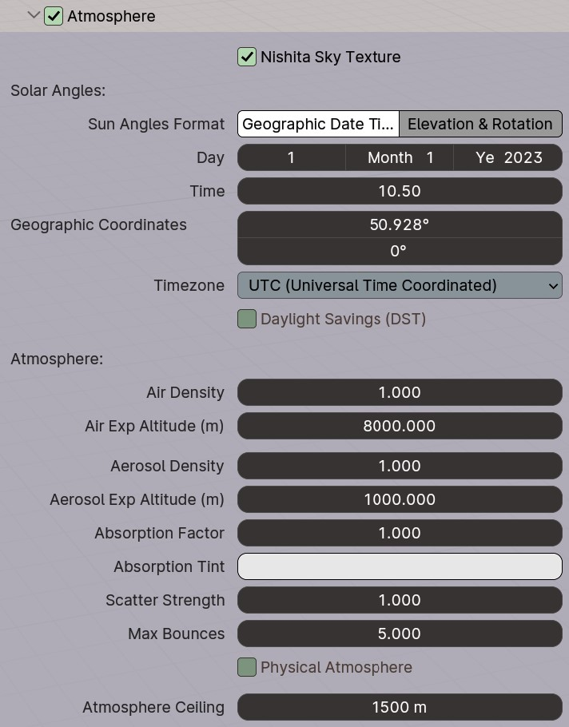

{: width=60% .center }

The atmosphere can be enabled in the atmosphere sub-panel. This will add an atmosphere domain around the scene and add a sky light (world background).

## Atmosphere Settings

{ width=50% }

**Nishita Sky Texture**  
You can disable this to unlink the Nishita sky texture and use a different one. The atmosphere volume will remain.

### Sun Angles
You can choose to control the sun angles using the Geographic Date Time or Elevation & Rotation modes.

#### Geographic Date Time
This will closely approximate the solar angles based on the time, date and geographic Earth coordinates, allowing for realistic sun animations and precise sky setups.

The longitude and latitude parameters describe where on the globe the scene is positioned. The default values correspond to the location of Greenwich in the UK. You can choose from a range of major worldwide timezones to set the clock to - note that this operates independently of latitude and longitude. In most cases, it makes sense to set the timezone to the nearest corresponding timezone for the geographic coordinates. You can also add daylight saving to each timezone, which simply puts the clock forwards by an hour.

The time is given in 24-hour decimal format, e.g. `2:30pm` = `14.5`.

#### Elevation & Rotation

**Sun Elevation**  
The elevation of the sun in degrees. At 90 degrees, the sun will be directly above the viewer, like at midday. Sunsets/sunrises occur at elevation angles approximately less than 7 degrees.

Note that the scene brightness changes drastically between 0-90 degrees of sun elevation and this will often need accounting for in the film exposure settings for Cycles.

**Sun Rotation**  
The angle of the sun relative to the horizontal in degrees (azimuth angle).

### Atmosphere

**Air Density**  
The sealevel density of air. Higher values produce a thicker looking atmosphere. Be careful changing this value from the default, as the exact appearance of the sky is very sensitive to the atmospheric density.

**Air Exp Altitude**  
Controls the exponential falloff of air density with altitude. At this altitude, the air density will be 36.7% of the sealevel density.

**Aerosol Density**  
The sealevel density of aerosols. Aerosols are larger particles in the air such as water vapour or smog that produce white foggy scattering.

**Aerosol Exp Altitude**  
Controls the exponential falloff of aerosol density with altitude.

**Absorption Factor**  
The amount of light that is absorbed by aerosols, making the distance appear darker. For a polluted air look, this value can be made higher. Humid air on the other hand does not absorb as much light, but could have a higher density.

**Absorption Tint**  
Applies a tint to the aerosol absorption for added artistic look to the sky. Water/humidity is grey (default tint); particles like sand can tint the atmosphere blue.

**Scatter Strength**  
Controls the proportion of light that is scattered forwards by aerosols towards the camera, producing a glow effect around the sun.

**Max Bounces**  
Limits the number of multiple scattering bounces (5 is generally sufficient for a normal atmosphere).

**Physical Atmosphere**  
Removes the Nishita sky colours (keeping the sun disk) from the world background and purely uses volumetric scattering for sky colour - see [below](#physical-atmosphere).

**Atmosphere Ceiling**  
PlanetSet generates an 'atmospheric shell' around the scene when the atmosphere is enabled. This shell extends upwards until it reaches the *ceiling altitude*.

You may want to make this value larger to recreate scattering for taller mountains or for high-altitude clouds. As the ceiling gets higher, the volume scattering shader contributes more towards the sky colour. At high ceiling values, there is enough atmosphere to create the sky colours without a Nishita background. The physical atmopshere option sets the background to black with a sun disk, and the colours of the sky are recreated naturally through volumetric scattering. The physical atmosphere ceiling value is different to the non-physical atmosphere value (10km by default).

**Ozone Density**  
Controls the strength of ozone (blue) absorption in the upper part of the atmosphere (physical atmosphere enabled only).

---

## Atmosphere Mode

### Nishita-Volume Hybrid

The Nishita sky model is the default sky model built into Blender which users may be familiar with. PlanetSet adds a part-scale medium around the planet to add the effect of Rayleigh scattering and haze to the terrain and distant clouds. The sky color comes from a combination of volume scattering and the sky lamp, which is fast but less accurate.

### Physical Atmosphere

Enabling the physical atmosphere will yield a slightly different result since all the of the sky color contribution comes from the atmosphere volume shader. It is particularly effective for high altitude shots, or when clouds are high altitude. You can also control the ozone layer density, which gives more control over the lighting color at sunset/sunrise. Note, because all of the lighting contribution comes from the volume shader, it takes much longer for the renders to converge when the sun angle is low. This can also mean that the initial result looks very different to the final converged render.