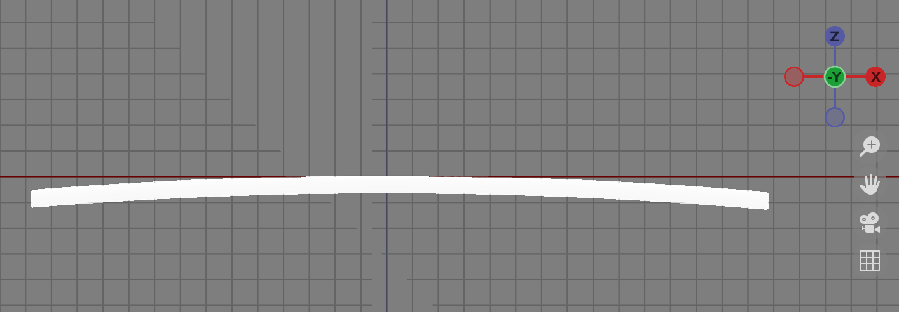
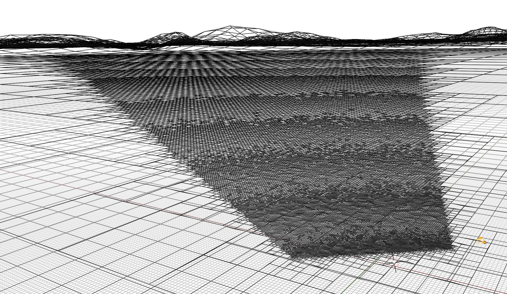

## Tessellations

### 25/08/2023

At some point when I was younger, I was captivated by artworks depicting other worlds. I have a memory of finding a free copy of [Bryce](https://en.wikipedia.org/wiki/Bryce_(software)) in a CD that came with a magazine (a vintage piece of 3D rendering software by today's standards). This introduced me to the concept of computer generated imagery and digital art, particularly with landscapes. This interest has stuck with me over the years and I occasionally make pictures of landscapes and worlds using 3D software. Being free to use, I have leant into learning Blender. Blender is a very powerful and comprehensive 3D tool, whilst also being open-source and highly flexible through its Python API. I also have a background in coding and computer graphics and I started to learn addon development for Blender around three years ago. My first addon was a product called Super Parallax, which is an advanced parallax occlusion mapping implementation for Blender Cycles & Eevee. After trying out some software like Vue and Terragen, I thought they suffered from being slow with very bespoke workflows. I decided to work on my own solution in Blender which ended up turning into the PlanetSet addon.

Blender ships with its capable Cycles renderer as well as a suite of geometry manipulation and scene creation tools. Modelling terrain surfaces manually is time-consuming and repetitive. This is why the introduction of geometry nodes in 3.0 was so important, as it allows things like this to be automated. In my opinion, the two terrain components that needed automation were scale and detail. I addresed this using a combination of the Python API and geometry nodes, taking inspiration from Terragen and the older REYES algorithm.

#### Method

To produce realistic horizons, the terrain's surface must be spherical like a planet. Since most of the sphere will be occluded by itself, we don't need the entire thing. The approach used in PlanetSet is to take a large plane and project it downwards onto a sphere. By projecting it downwards from the centre of the plane, we maintain floating point precision at the peak where the viewer is most likely to be. The plane is made up of quads that tessellate nicely. The quad size is scaled based on how high the viewer is, to ensure consistent tessellation (more on this later).

To produce a convincing horizon, we need to ensure that the plane is large enough such that some terrain goes beyond visible curvature. One simple way of doing this is to figure out the distance from the viewer to the tangent of a sphere:

Since the surface of the planet is not perfectly smooth, we can add on a fudge factor to the height to create slightly more terrain over the horizon. This is what the altitude bias parameter does in PlanetSet.

The next step is detail. If we were to equally subdivide the entire terrain surface, we would quickly run out of memory as the surface area of the terrain is far too large to have a fixed number of faces per unit area. Instead, we can subdivide the geometry relative to the camera, since *most* mesh detail is directly perceived in the image space rather than world space. The exceptions here are mainly shading effects like shadows and reflections from outside the frustum and distant surface roughness that could affect the sub-pixel shading.

To know whether to dice (subdivide) a quad face, we need to measure its projected area in screen space. If the projected area is larger than the dicing rate (facets per pixel), we dice it. This is approximated in PlanetSet using the inverse square law multiplied by the cosine of its angle to the camera (which actually turns out to be a simple dot product). I also scale this result by some magic constants, which were found empirically, to make it in terms of useful units. Since displacing the terrain will significantly affect how the surface projects onto the image space, the face area measurements need to occur on the displaced surface (consider how going from a flat sphere to huge mountains would change the face projections for example). This means we first displace the smooth sphere surface, figure out which faces need to be diced, then dice the *un-displaced* smooth surface based on this information. This cycle is repeated until all facets are small enough in image space, or we have reached the iteration limit. We also omit faces outside the camera frustum for more efficiency (using the quad centroids to check).

Going forwards, Blender 4.0 will feature repeat nodes and caching in geometry nodes, which will allow this process to be done much more efficiently.

I also am hoping that at some point in the future, it will be possible to selectively subdivide faces rather than splitting the mesh and subdividing. This would prevent light leaks in the terrain surface which is a frustrating current limitation.