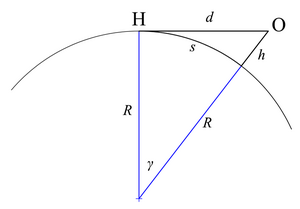
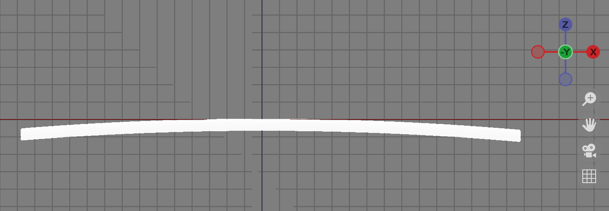
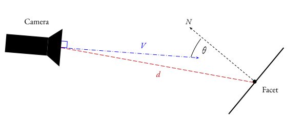
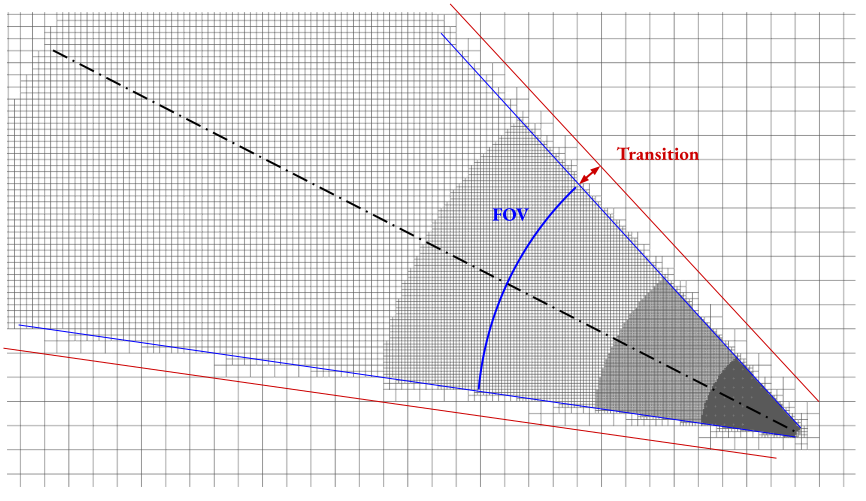
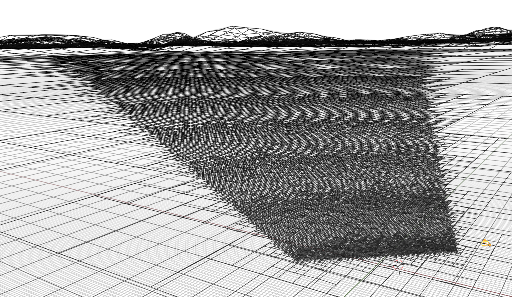

When geometry nodes were introduced in Blender 3.0, a range of things were suddenly possible with automation, specifically algorithmically-generated meshes that would be impossible or very time consuming for a human to make. Unlike the Blender Python API, geometry nodes are fully integrated with all data types within a scene, which makes it very powerful. Moreover, it's actually quite well optimised. This lends itself to two aspects of natural environment renders that are important: scale and detail.

In order to simulate realistic horizons, the terrain’s surface needs to be spherical—resembling a planet. Since large portions of the sphere will be hidden from the viewer on the surface, generating the entire sphere is unnecessary. The approach I’ve implemented in PlanetSet involves projecting a large plane downward onto the sphere, originating from the plane's center. This retains floating-point precision closer to the viewer. The plane itself consists of quads that tessellate in a grid-like fashion, with the base-size of these quads scaled according to the viewer’s altitude to maintain a near-constant size in screenspace.

The next step is ensuring that the plane is sufficiently large so that a portion of the terrain extends beyond the visible curvature of the planet. The approach used is to calculate the distance from the viewer to the tangent point on the planet’s surface, which is $d = \sqrt{2Rh + h^2}$:

To account for large surface features like mountains that might peak over the horizon, an altitude bias is added, which extends the terrain slightly beyond the horizon distance.

{: width=500pt}

Uniformly subdividing the entire terrain surface would be prohibitively inefficient, as the surface area of a planet is far too vast to maintain a fixed number of faces per unit area. Instead, a form of adaptive subdivision is used, a technique that refines geometry based on the proximity to the camera. Because geometric detail is mostly perceived in screenspace, the level of subdivision should be tied to the camera’s view rather than world space. This is a lot like the REYES method and the approach used by Terragen.

This method is slightly flawed when accounting for global shading effects like shadows and reflections, which may involve regions outside the camera frustum.  A low-resolution representation of terrain outside of the view frustum suffices in most cases (setting clip to off does this).

To determine whether a given quad face should be subdivided (or "diced"), its projected area in screen space is evaluated. If the projected area exceeds the dicing threshold (a set number of facets per pixel), it is subdivided. This is approximated using an inverse-square law of the distance between the camera origin and the face centroid, further scaled by the cosine of the angle of the face relative to the camera forward vector. The final scaling factor is fine-tuned using empirically derived constants, converting the result artist-friendly units.

{: width=800pt }

$$scaling =  \frac{\hat{V}\cdot\hat{N}}{d^2}$$

The projected area of a face can change dramatically when surface displacement—such as raising mountains—is applied. As such, the face areas are recalculated after displacing the smooth sphere surface, and the geometry is subdivided accordingly. This subdivision loop continues until all faces are sufficiently small in screen space or an iteration limit is reached.

Faces outside the camera frustum are skipped by comparing the angles between the frustrum angles and the face centroids. The transition angle overwhich the coarsest faces tessellate into the finest faces is accounted for. Optionally, geometry entirely outside the frustum can be discarded, a step that generally improves performance, even when most of the geometry remains visible within the frame.

{: width=800pt }

{: width=800pt }

Something else that is interesting is that sub-pixel surface imperfections that are very far in the distance would change the effective distribution of the BSDF - this an effect can be approximated using shader tricks. Another limitation is that the 'projection' into screen space is an approximation, so artifacts might be visible in wide-angle or panoramic cameras, something that could potentially be resolved using camera matrices.

Blender 4.0 introduces new features like repeat nodes and caching checkpoints within geometry nodes, which significantly speeds up parts of the terrain tessellation process. A current limitation is that selective subdivisions in geometry nodes require splitting the terrain mesh, which can create light leak artifacts - I'd be interested in seeing selective subdivision implemented natively.