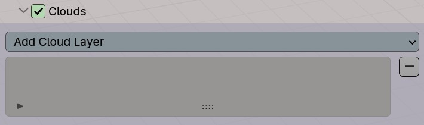
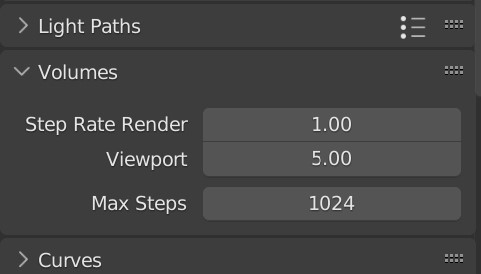

# Clouds Panel

The clouds panel is located in the atmosphere panel. To enable clouds, check the check box in the clouds panel header.

{: style="width: 35%"}

If you used the `Adjust Cycles Settings` operator, the viewport [step rate](https://docs.blender.org/manual/en/latest/render/cycles/render_settings/volumes.html) will be set to 5 to speed up interactive rendering. This will make clouds look less detailed and also less dense, so it is a good idea to occasioanlly turn the step rate down to preview what the clouds will look like in the final render.

{: width=50% }

---

# Cloud Layer Types

!!! Warning
    Do not translate the cloud domain in the z axis as this will cause the cloud shader to not malfunction. Control altitude using the settings.

!!! Note
    The domain settings are currently decoupled from the shader settings due to limitations regarding geometry nodes. Make sure to match the domain radius, height and altitude with the shader.

## Generic Clouds

This cloud layer can be used to recreate many different types of clouds by altering the parameters. The cloud domain contains the cloud shader medium. It is a cylinder that follows the curvature of the planet when the radius is large enough, meaning clouds may extend over the horizon.

This cloud shader is more suited to softer clouds that don't have billow features, such as stratus and cirrus clouds.

### Settings

**Domain Radius**  
Radius of the cylindrical cloud domain.

**Domain Height**  
Height of the cylindrical cloud domain.

**Domain Altitude**  
The altitude of the domain.

**Height**  
The overall depth of the cloud layer.

**Altitude**  
The altitude of the cloud layer in the shader (should be identical to domain altitude).

**Radius**  
The radius in which the cloud layer terminates completely (should match domain radius).

**Inner Radius**  
The radius at which the cloud falloff begins.

**Density**  
The overall scattering density of the cloud layer. Higher values yield thicker, darker looking clouds that let less light through.

**Coverage**  
Controls the amount of cloud in the domain. A lower value produces smaller clouds with more spacing and vice versa for a higher value.

**Scale**  
Controls how large each individual cloud is. Smaller values produce larger looking cloud features.

**Base Roughness**  
Determines how smooth/turbulent the base of the clouds are.

**Upper Roughness**  
Like base roughness, but for the top of the clouds. Clouds are typically rougher at the top.

**Sharpness**  
Controls how abrupt the cloud edges are (which also makes the edges more dense).

**Edge Darkness**  
Artificially increases the darkness of the exterior parts of the clouds, giving them a 'powder' look. This effect is more prominent when the step rate decreases, so be careful not to increase it too much or it will make the clouds look dark.

**Dark Edge Sharpness**  
Defines the sharpness of the dark edges. Higher values will make the edges sharper, but also decrease the overall darkness.

**Stretch Factor**  
This parameter stretches the cloud shader domain, causing clouds either to look flatter or taller. Higher values will make the clouds look flatter and vice versa. This can be used to create flatter cirrus or stratus clouds.

---

## Billow Clouds

This cloud layer is similar to generic clouds, but uses a billow fractal to produce cloud shapes found more often in in cumulus clouds.

### Settings

**Domain Radius**  
Radius of the cylindrical cloud domain.

**Domain Height**  
Height of the cylindrical cloud domain.

**Domain Altitude**  
The altitude of the domain.

**Height**  
The overall depth of the cloud layer.

**Altitude**  
The altitude of the cloud layer in the shader (should be identical to domain altitude).

**Radius**  
The radius in which the cloud layer terminates completely (should match domain radius).

**Inner Radius**  
The radius at which the cloud falloff begins.

**Density**  
The overall scattering density of the cloud layer. Higher values yield thicker, darker looking clouds that let less light through.

**Coverage**  
Controls the amount of cloud in the domain. A lower value produces smaller clouds with more spacing and vice versa for a higher value.

**Scale**  
Controls how large each individual cloud is. Smaller values produce larger looking cloud features.

**Primary Billowness**  
Controls the strength of the billow pattern on the base shape of the cloud.

**Secondary Billowness**  
Controls the strength of the billow pattern on the cloud details.

**Sharpness**  
Controls how abrupt the cloud edges are (which also makes the edges more dense).

**Edge Darkness**  
Artificially increases the darkness of the exterior parts of the clouds, giving them a 'powder' look. This effect is more prominent when the step rate decreases, so be careful not to increase it too much or it will make the clouds look dark.

**Dark Edge Sharpness**  
Defines the sharpness of the dark edges. Higher values will make the edges sharper, but also decrease the overall darkness.

---

## Cirrus 2D

High altitude strandy/wispy clouds. This cloud layer is a 2D approximation which works well at high altitudes.

### Settings

**Alttiude**  
The altitude of the cloud plane.

**Density**  
Controls the strength of the clouds. Higher values look thicker and scatter more light.

**Scale**  
The overall scale of the cloud shape features. Lower values are larger and higher values are smaller.

**Softness**  
Controls how abrupt the cloud edges are.

---

## Mist Volume

Ground level fog/mist that exponentially decays with altitude. Fog/mist usually occurs at night, dawn or dusk.

### Settings

**Radius**  
Radius of the cylindrical mist domain.

**Depth**  
The height of the mist domain.

**Density**  
The sea-level scattering desnity of the mist.

**Exp Altitude**  
The altitude in which the density is 36.7% that of the sea-level density.

**Base Altitude**  
The altitude that represents the zero height level for the exponential density. Since the exp altitude cannot be negative, if you would like the exp altitude to be lower than sea level, you can set the base altitude to a negative value.