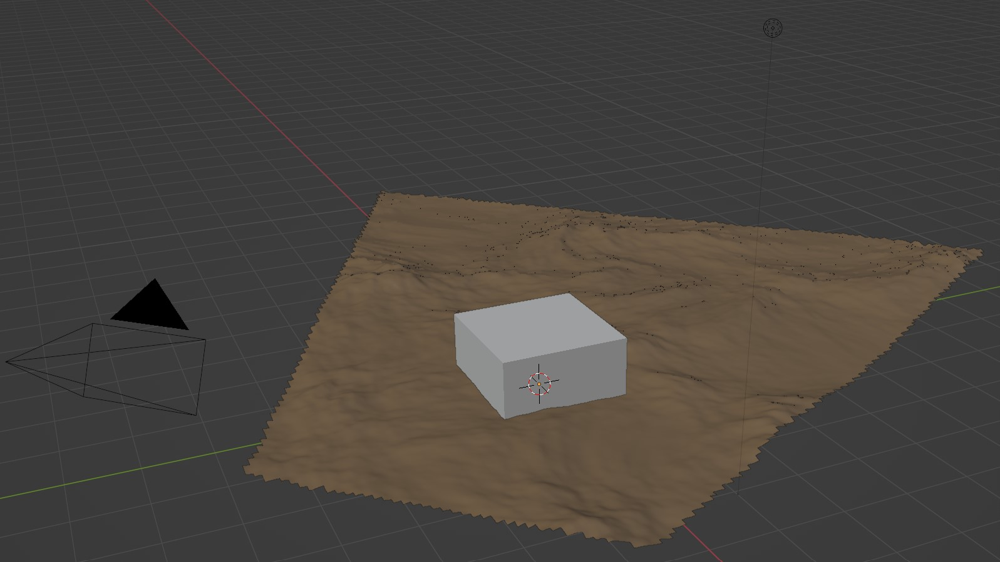
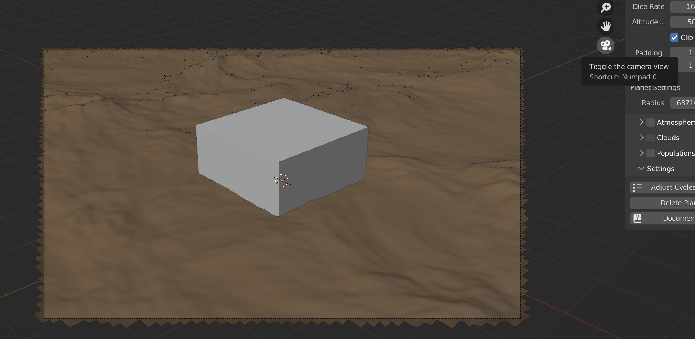
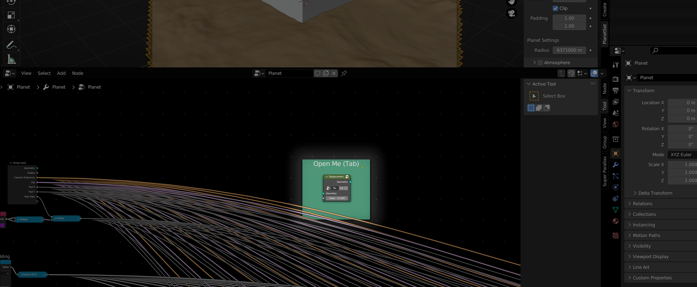
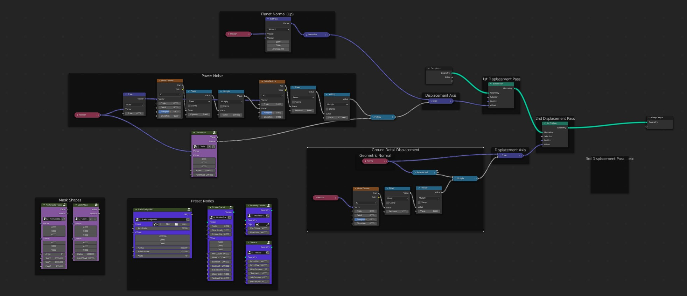
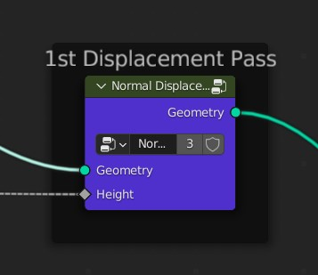

# Getting Started

## Installation

Your download will contain a file called `planetset_xxxx_xx.zip` (depending on version) which you will need to install and enable by going to `Edit->Preferences->Addons`, pressing `Install` and selecting the .zip file. Then you **must restart Blender** to complete the installation.

## User Interface

The PlanetSet panel is located in the 3D viewport toolbar, which can be toggled by pressing ++n++.

You can enable/disable different components of the planet with the checkboxes in the panel headers.

## Understanding the PlanetSet Workflow

### Render Settings

PlanetSet is made to render through Cycles only and works well with certain render settings. These settings can be automatically set up using the `Adjust Cycles Settings` operator, which is located in the settings sub panel. This will increase the number of volume bounces, which is important for realstic clouds and atmosphere. Additionally, the volume step rate will be increased for viewport rendering to make things smoother. The color management gamma and exposure settings are also altered to account for the bright daylight.

{ width=50% }

### Using the Camera

New users can find PlanetSet initially unintuitive and tricky. Upon enabling the planet, if you have deleted the scene's main camera you will see no terrain, so you need to make sure there is a camera present. PlanetSet will always generate terrain inside the active camera view, so initially you might be confused as to why only a small chunk of terrain is visible.

{: width=70% }
{: width=70% }

The terrain generation process has some latency, depending on the [dicing rate](planet.md#dice-rate). It is **not recommended** to grab the camera and move it with the mouse cursor or to use the fly cam whilst locked to the camera view, as the latency will usually make this unusable. Instead, you can find the view you want using the viewport flycam, then use the [Align Camera to View](https://docs.blender.org/manual/en/2.79/editors/3dview/navigate/align.html#align-view-menu) operator to change the cmaera view to the viewport view.

You might see [z-fighting](https://en.wikipedia.org/wiki/Z-fighting) on distant terrain features due to the increased depth buffer limit. This artifact is only visible in the viewport preview and will not appear in the Cycles render. This way, you can still see terrain features many kilometers away. You can disable this feature in the [addon preferences](addon preferences.md).

### Displacement Nodes

The planet surface starts off as a section of smooth sphere. Using geometry nodes, this surface is then displaced as along the planets normal (or any vector you like). To access the displacement node group, select the planet surface and open the geometry node editor. Find the node group called 'Displacement' and open the group by pressing ++tab++ with it selected.

The default node network template uses some noise patterns to generate a generic looking terrain and masks it with a large circle to create a flat valley (nodes shown below). There are [terrain node group presets](terrain nodes.md) available in this network to help you get started.

{: .zoom }

Displacement works similarly to how it would normally in Blender, except the displacement effect is achieved by offsetting vertices using a [Set Position Node](https://docs.blender.org/manual/en/latest/modeling/geometry_nodes/geometry/set_position.html).

{: width=70% }

The vertices are displaced along a vector that should be [normalised](https://docs.blender.org/manual/en/latest/modeling/geometry_nodes/vector/vector_math.html#properties) to unit length to preserve consistent scaling. The displacement is typically the surface normal, but you can change this to achieve more complex displacement shapes.

Displacement effects can be stacked using multiple passes of the Set Position node. The default node network has two displacement passes: the first for the main terrain and the second for ground details.