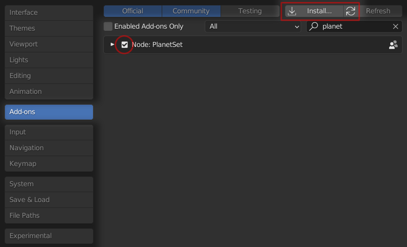
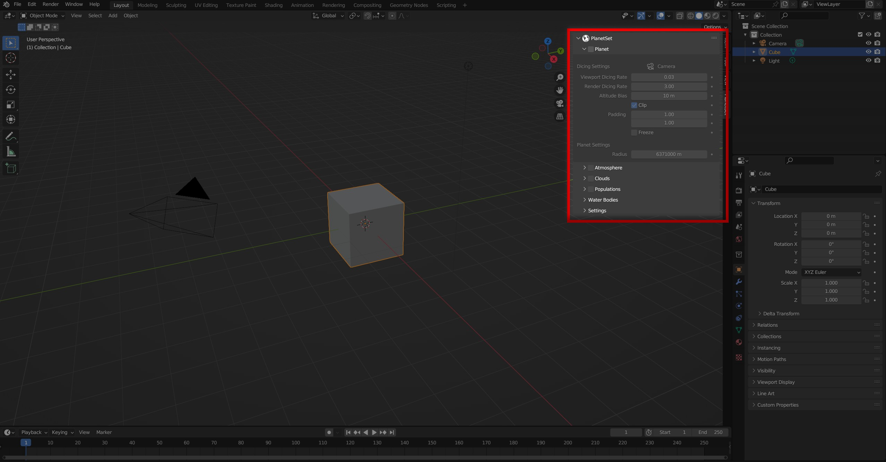
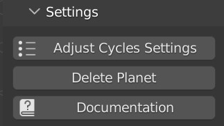

# Getting Started

## Installation

Your download will contain a file called `planetset_xxxx_xx.zip` (depending on version) which you will need to install and enable by going to `Edit->Preferences->Addons`, pressing `Install` and selecting the .zip file. Then you **must restart Blender** to complete the installation.

## User Interface

The PlanetSet panel is located in the 3D viewport toolbar, which can be toggled by pressing ++n++.

You can enable different parts of the planet by using the checkboxes in the panel headers.

## Render Settings

PlanetSet is made to render through Cycles only and works well with certain render settings. These settings can be automatically set up using the `Adjust Cycles Settings` operator, which is located in the settings sub panel. This will increase the number of volume bounces, which is important for realstic clouds and atmosphere. Additionally, the volume step rate will be increased for viewport rendering to make things smoother.

{ width=50% }