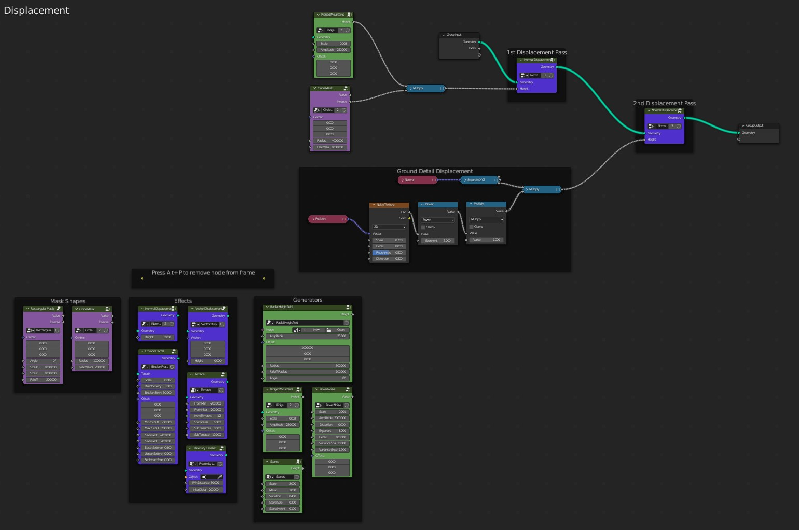

# Getting Started

## Installation

Your download will contain a file called `planetset_xxxx_xx.zip` (depending on version) which you will need to install and enable by going to `Edit->Preferences->Addons`, pressing `Install` and selecting the .zip file. Then you **must restart Blender** to complete the installation.

## User Interface Introduction

The PlanetSet panel is located in the 3D viewport toolbar, which can be toggled by pressing ++n++. The panel contains the majority of the functionality for PlanetSet.

You can quickly enable/disable different components of the planet with the checkboxes in the panel headers. If a camera is present, you can enable the planet, which will create a planetary terrain in the scene.

## Understanding the PlanetSet Workflow

### Render Settings (Important)

PlanetSet is made to render through Cycles only and requires certain render settings to produce realistic results. These settings can be automatically set up using the `Adjust Cycles Settings` operator, which is located in the settings sub panel. You can optionally make this happen automatically when enabling PlanetSet by going into the addon preferences.

The adjustment will change the path length limits, which is important for high-quality renders. For example, the exact appearance of clouds largely depends on the effects of multiple scattering, which can require as much as 250 volume bounces. The same principle applies to other volumetric scattering processes like mist and atmosphere. Additionally, trees with many alpha cut-out leaves and translucent shaders require potentially hundreds of transmissive light bounces to render correctly. For these reasons, it is reccommended to change these settings whenever creating a scene with PlanetSet.

Additionally, the viewport renderer volume step rate will be increased to make Cycles previews more responsive. The color management gamma and exposure settings are also altered to account for the bright daylight.

{ width=50% }

### Using the Camera

Upon enabling the planet, there must be a camera present in the scene. PlanetSet will generate terrain inside the active camera frustum by default. You can reassign another camera by seleting it and using the `Reassign Camera` operator (found in search menu).

{: width=70% }
{: width=70% }

The terrain generation process has some latency, depending on the [dicing rate](planet.md#dice-rate). You can [freeze](planet.md#freeze) the terrain to move the camera around without the latency, then unfreeze it when finished. Alternatively, you can find the view you want using the viewport flycam, then use the [Align Camera to View](https://docs.blender.org/manual/en/2.79/editors/3dview/navigate/align.html#align-view-menu) operator to change the cmaera view to the viewport view.

You might see [z-fighting](https://en.wikipedia.org/wiki/Z-fighting) on distant terrain features due to the increased depth buffer limit. This artifact is only visible in the viewport preview and will not appear in the Cycles render. This way, you can see terrain features many kilometers away in the viewport. You can change the depth buffer settings in the [addon preferences](addon preferences.md).

### Displacement Nodes

### Finding the Terrain Nodes - Method 1:

The planet surface starts off as a section of smooth sphere. Using geometry nodes, this surface is then displaced as along the planets normal (or any vector you like) and the adaptive subdivision for the displacement is handled automatically. To access the displacement node group, open the geometry nodes editor and press the Terrain Nodes button in the top right corner. You can also pin the nodes so they don't go away when other objects are selected.

{: .zoom }

### Finding the Terrain Nodes - Method 2:

Alternatively, you find the node group called 'Displacement' in the Planet modifier and open the group by pressing ++tab++ with it selected.

### Default Terrain Nodes

The default node network template uses some noise patterns to generate a generic looking terrain and masks it with a large circle to create a flat valley (nodes shown below). There are [terrain node group presets](terrain nodes.md) available in this network to help you create landscapes.

Displacement works similarly to how it would normally in Blender, but by instead passing the terrain geometry through a [displacement node](terrain nodes.md#normal-displacement).

{: width=40% }

Displacement is typically done along the surface normal, but you can use the [vector displacement node](terrain nodes.md#vector-displacement) to displace along any arbitrary direction.

Displacements can be stacked in multiple passes. The default node network has two displacement passes: the first for the main terrain and the second for ground details.

<! --- ### Working with Fractals

PlanetSet uses a unique adaptive subdivision process that allows for very high-detail terrain. To get realistic details, it's highly effective to use fractal noises. Fractal noises produce self-similar 'inifnite' patterns that are good at mimicking patterns in nature. PlanetSet comes with some premade noises, and you can design your own in geometry nodes using the [fractal noise designer]() feature. >