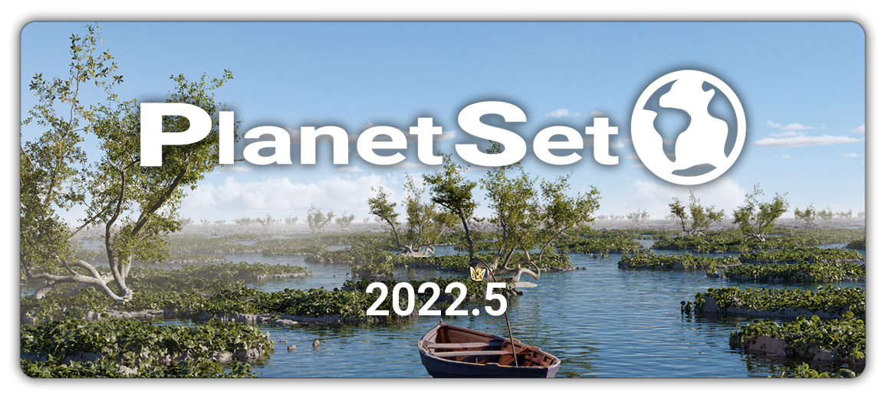
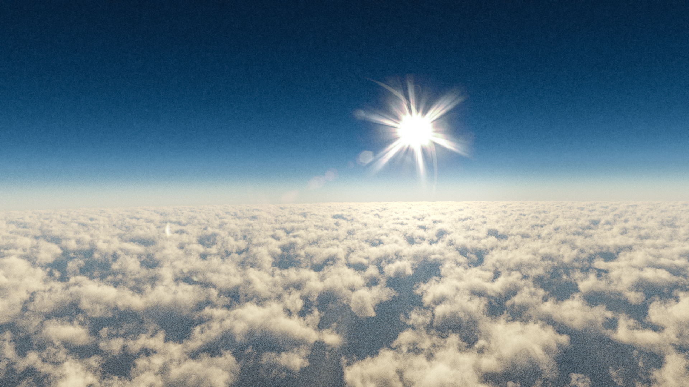

{: .center width=69%}

# Welcome to PlanetSet

Thanks for buying PlanetSet! If you encounter any bugs or issues please contact me on [BlenderMarket](https://blendermarket.com/) or in the [PlanetSet Discord](https://discord.gg/d5CCkh5pJs).

This version is a beta, so it is not fully featured and will have content updates.

For installation instructions, see [getting started](getting started.md).

# Changelog

## 2022.5 (Beta) - 20/01/2023

{: .center width=60%}

A little overdue, this update contains major improvements to the addon as well as some new features and content.

- **New:** Overhauled [water system](water.md): water is now created and controlled through the [water bodies](water.md) panel.
- **New:** New realistic water shader with volumetric coloring, ripples, foam and [more](water.md).
- **New:** Oceans are now displaceable micropolygon surfaces like terrain.
- **New:** Can convert your own objects to water bodies. Read more [here](water.md#user-water-bodies).
- **New:** The dice rate setting is now in units of facets per pixel so that the subdivision can be precisely controlled. Read more [here](planet.md#dicing-rate).
- **New:** There are now two dicing rate settings for the viewport and render modes. This allows the rendering of higher dicing rates in Cycles without affecting the viewport.
- **New:** Terrain nodes [shortcut button](getting started.md#displacement-nodes) in the geometry nodes panel.
- **New:** Option to center cloud domains over the 3D cursor when adding a new cloud layer.
- **New:** Option to automatically switch to Cycles with optimal settings when PlanetSet is enabled. See [here](addon preferences.md#change-cycles-settings-on-init).
- **New:** Reassign camera operator (found in search menu).
- **Improved:** Generic cloud shader density is now modulated with height.
- **Improved:** Improved scattering phase function in cloud shaders for more realistic cloud tones.
- **Improved:** Atmospheric density values are in terms of a factor (default equal to 1) rather than the actual volume density measure.
- **Improved:** You can now add cloud layers without enabling the atmosphere incase you would like to use alternative sky lighting.
- **Improved:** Cloud domains are now represented by cylindrical bounds instead of wireframes.
- **Improved:** General improvements to the underlying addon system.
- **Fix:** Physical sky not switching back to Nishita sky after saving .blend file.
- **Fix:** No UI handle for no active camera in scene.
- **Docs:** New minimalist theme to the documentation website.
- **Docs:** Improvements/amendments to existing documentation.

## 2022.4 (Beta) - 12/09/2022

{: .center width=60%}

{: .center width=80% }

- **New:** [Freeze option](planet.md#freeze) in the planet settings that stops the terrain from updating whilst enabled. Useful for moving/animating the active camera.
- **New:** [Physical atmosphere](atmosphere.md#physical-atmosphere) option available (limited to 1/5th scale).
- **New:** [Ridged mountains](terrain nodes.md#ridged-mountains) procedural node.
- **New:** Procedural [stones](terrain nodes.md#stones) node.
- **New:** [Cliff rocks](terrain nodes.md#cliff-rocks) effect node.
- **New:** [Strata](terrain nodes.md#strata) effect node.
- **New:** [Normal and vector displacement](terrain nodes.md#normal-displacement) node groups.
- **New:** Custom UI icon.
- **Improved:** Significantly increased efficiency of terrain dicing in response to high camera altitudes.
- **Improved:** Atmosphere shader now accounts for ozone layer absorption (more accurate dawn/dusk).
- **Improved:** Removed the vector input from mask nodes as they are misleading.
- **Improved:** Improved default scene.
- **Fix:** Atmosphere not updating correctly with camera altitude.
- **Fix:** Rectangular mask falloff.
- **Docs:** Numerous improvements and additions to the docs.

## 2022.3 (Beta) - 23/08/2022

2022.3 features a complete overhaul of the planetary terrain implementation, allowing for micropolygon displacement which drastically increases the achievable detail of terrains. Note this is not dependant the Cycles experimental feature and works in the raster viewport preview. See [getting started](getting started.md) for a brief overview of the updated workflow.

{: .center width=80% }

- **New:** Novel [dicing method](planet.md#dice-rate) which provides almost perfect per-pixel dicing for more accurate details in terrain and micropolygon displacement without Cycles Experimental.
- **New:** Terrain displacement is now carried out completely in geometry nodes with no modifier stacks, enabling greater control for artists (existing presets have been converted to node groups).
- **New:** Terrain [clip option](planet.md#clip), which when enabled will discard terrrain geometry outside of the camera frustum. For high detail renders this can save a significant amount of memory.
- **New:** More efficient and precise rectangular camera frustum clipping implementation with [padding](planet.md#padding) options.
- **New:** Vector displacement (along geometry normals etc) is now properly supported and works with micropolygon dicing.
- **New:** New options when adding a Plant Instancer to center to the 3D cursor and automatically create a collection from the selection.
- **New:** [Mask shape nodes](terrain nodes.md) that can be used to manipulate terrain.
- **New:** The terrain presets are no longer located in the planet panel, but are instead available inside the node group.
- **New:** The default planet surface has a preset applied.
- **Improvement:** [Altitude bias](planet.md#altitude-bias) now adds onto the camera altitude automatically.
- **Improvement:** Some UI improvements and optimisations.
- **Improvement:** Default Generic Cloud edge darkness and sharpness values made much lower.
- **Improvement:** Default Plant Instancer min height set to -1m to avoid confusion.

## 2022.2 (Beta) - 03/08/2022
- **New:** Sun elevation and rotation shortcut in atmosphere settings.
- **New:** [Proximity Leveller](terrain nodes.md#proximity-leveller) terrain modifier.
- **New:** Overhauled the Billow Clouds shader, 'Cloud Fractal 2', which is faster and provides more consistent details and roughness control.
- **New:** Exposure and gamma in color management settings are automatically changed when using the Adjust Cycles Settings operator (can be switched off in addon preferences).
- **New:** Auto Leaf convenience operator to automatically set up leaf materials (alpha and translucency) if they are not already.
- **Improvement:** Terrain tessellation responds better to changes in FOV and altitude bias.
- **Improvement:** Mist density is now modulated by fractal noise for increased realism. See [mist](clouds.md#mist-volume).
- **Improvement:** Improved water realism by changing roughness variation modulator to a power fractal.
- **Improvement:** Atmosphere and sky default values changed to improve realism.
- **Improvement:** Adding a user displacement terrain modifier now copies the node group template.
- **Improvement:** Docs button moved in addon preferences.
- **Fix:** Power Clouds coverage issue fixed.
- **Docs:** Docs now have permalinks on headers.