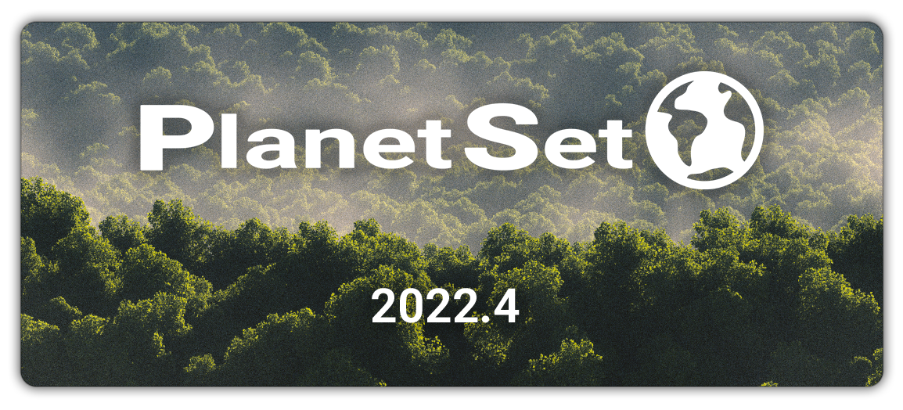
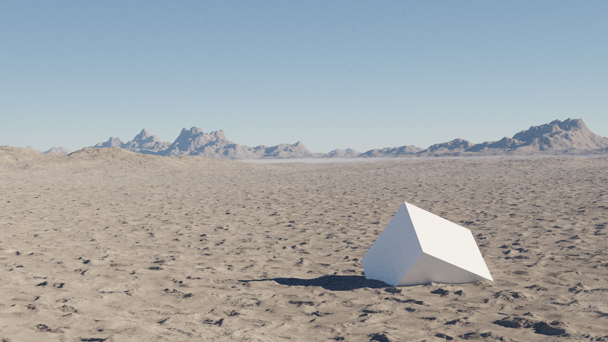

{: .center width=66%}

**Current Version:** 2022.3 (Beta)

# Welcome to PlanetSet

Thanks for buying PlanetSet! If you encounter any bugs or issues please contact me on [BlenderMarket](https://blendermarket.com/) or in the [PlanetSet Discord](https://discord.gg/d5CCkh5pJs).

This version is a beta, so it is not fully featured and will have content updates.

For installation instructions, see [getting started](getting started.md).

The docs should cover every feature of PlanetSet and provide some basic tutorials. You can use the search bar to search the docs for keywords. If you think something is missing, please contact me.

# Changelog

## 2022.3 (Beta) - 18/08/2022

2022.3 features a complete overhaul of the planetary terrain implementation, allowing for micropolygon displacement which drastically increases the achievable detail of terrains. Note this is not dependant the Cycles experimental feature and works in the raster viewport preview. See [getting started](getting started.md) for a brief overview of the updated workflow.

{: .center width=80% }

- **New:** Novel [dicing method](planet.md#dice-rate) which provides almost perfect per-pixel dicing for more accurate details in terrain and micropolygon displacement without Cycles Experimental.
- **New:** Terrain displacement is now carried out completely in geometry nodes with no modifier stacks, enabling greater control for artists (existing presets have been coverted to node groups).
- **New:** Terrain [clip option](planet.md#clip), which when enabled will discard terrrain geometry outside of the camera frustum. For high detail renders this can save a significant amount of memory.
- **New:** More efficient and precise rectangular camera frustum clipping implementation with [padding](planet.md#padding) options.
- **New:** Vector displacement (along geometry normals etc) is now properly supported and works with micropolygon dicing.
- **New:** New options when adding a Plant Instancer to center to the 3D cursor and automatically create a collection from the selection.
- **New:** [Mask shape nodes](terrain modifiers.md) that can be used to manipulate terrain.
- **New:** The terrain presets are no longer located in the planet panel, but are instead available inside the node group.
- **New:** The default planet surface has a preset applied.
- **Improvement:** [Altitude bias](planet.md#altitude-bias) now adds onto the camera altitude automatically.
- **Improvement:** Some UI improvements and optimisations.
- **Improvement:** Default Generic Cloud edge darkness and sharpness values made much lower.
- **Improvement:** Default Plant Instancer min height set to -1m to avoid confusion.

## 2022.2 (Beta) - 03/08/2022
- **New:** Sun elevation and rotation shortcut in atmosphere settings.
- **New:** [Proximity Leveller](terrain modifiers.md#proximity-leveller) terrain modifier.
- **New:** Overhauled the Billow Clouds shader, 'Cloud Fractal 2', which is faster and provides more consistent details and roughness control.
- **New:** Exposure and gamma in color management settings are automatically changed when using the Adjust Cycles Settings operator (can be switched off in addon preferences).
- **New:** Auto Leaf convenience operator to automatically set up leaf materials (alpha and translucency) if they are not already.
- **Improvement:** Terrain tessellation responds better to changes in FOV and altitude bias.
- **Improvement:** Mist density is now modulated by fractal noise for increased realism. See [mist](clouds.md#mist-volume).
- **Improvement:** Improved water realism by changing roughness variation modulator to a power fractal.
- **Improvement:** Atmosphere and sky default values changed to improve realism.
- **Improvement:** Adding a user displacement terrain modifier now copies the node group template.
- **Improvement:** Docs button moved in addon preferences.
- **Fix:** Power Clouds coverage issue fixed.
- **Docs:** Docs now have permalinks on headers.