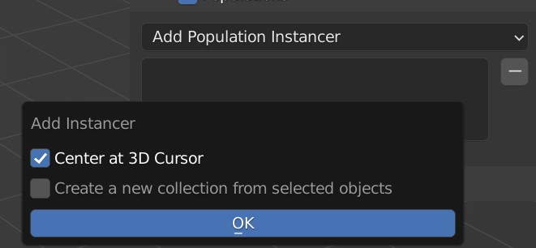

# Populations

Instancers can be used to automatically place many of the same objects in the scene. Instancers create groups of instances called populations and can be controlled via the populations sub panel. To add a population, use the `Add Population Instancer` menu.

{ width=50% }

!!! Tip

    It is reccommended to set the [viewport display](https://docs.blender.org/manual/en/latest/scene_layout/object/properties/display.html) mode to a low quality representation such as bounds for objects that will be instanced. You can set the viewport display mode for many selected objects all at once using the `Set Viewport Display` operator.

    { width=40%; set=left }
    { width=58%; set=right }

Enable all populations by checking the populations panel header.

---

## Plant Instancer

{ width=30% }

You can choose to automatically center the population at the 3D cursor or create a new collection to instance from, from the selected objects.

{: width=50% }

### Settings

**Collection**  
The collection used to randomly select objects from to instance.

**Center**  
The central position of the population.

**Radius**  
The extent of the population region (from the center).

**Seed**  
Seeds the randomization of the instance distribution.

**Clip to Camera**  
If true (1), will not instance on any surface outside the camera view frustum.

**Min Scale**  
Minimum random scale factor.

**Max Scale**  
Maximum random scale factor.

**Min Height**  
Instances won't appear below this height (in meters).

**Max Height**  
Instances won't appear above this height (in meters).

**Normal Alignment**  
Controls how much the instances should align to the surface normal.

**Density**  
The overall density factor of the instances (how many instances per unit area are created). You may need to adjust this value if the other factors increase or decrease the overall density.

**Altitude Factor**  
How much influence altitude decay has on the density.

**Exp Altitude**  
The height in which the density decays to 36.7% its original density (as part of an exponential fall off).

**Gradient Factor**  
How much influence the surface steepness has on the density. Higher values will reduce the density on steeper slopes.

**Noise Factor**  
How much influence the noise modulation has on the density.

**Noise Scale**  
The size of the noise features.

---

## Autoleaf

The autoleaf operator is a utility that can be used to automatically set up leaf materials on imported plant meshes. It adds a transparency shader for the leaf texture alpha channel and a translucency shader.

The autoleaf operator can be found in the operator search menu (++space++). It will apply changes to the material in actively selected material slot.

