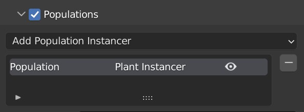
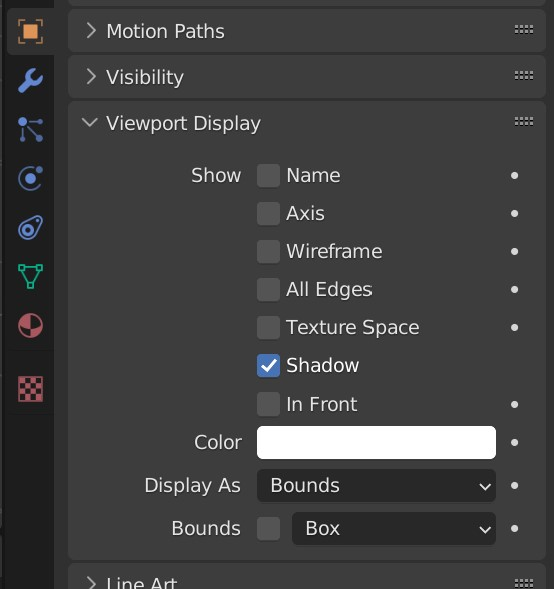
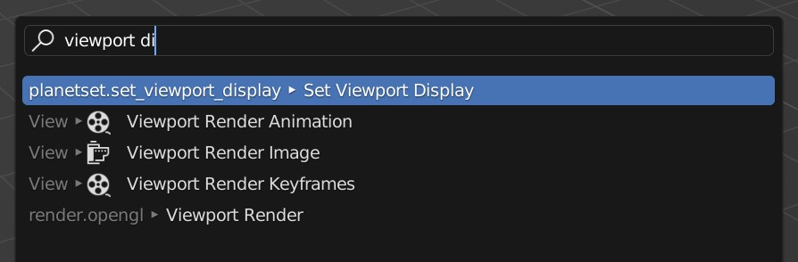
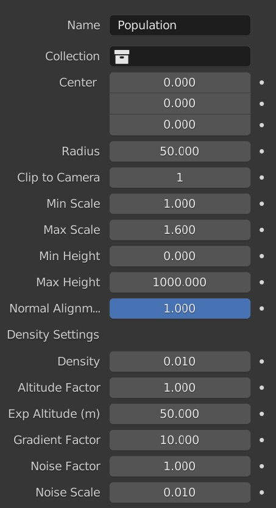
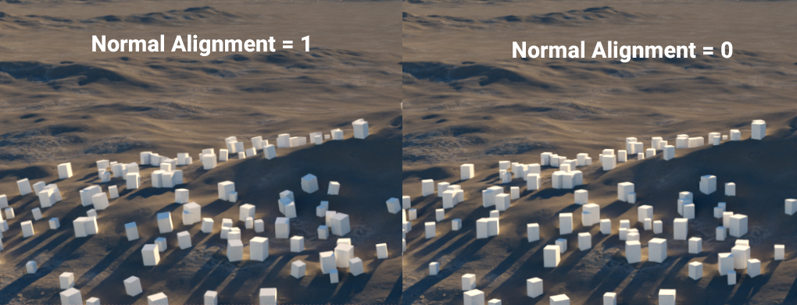
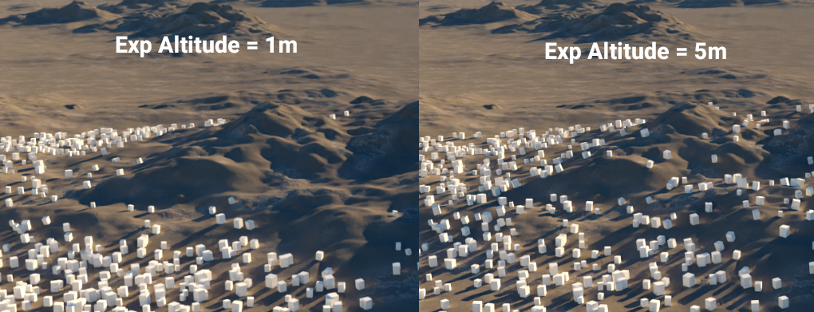
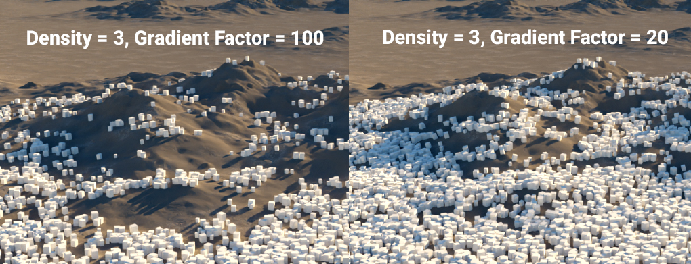
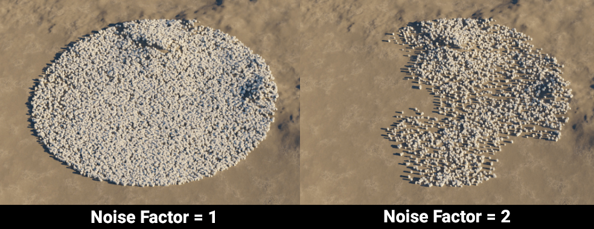

# Populations

Instancers can be used to automatically place many of the same objects in the scene. Instancers are called populations in PlanetSet and can be used via the populations sub panel. To add a population, use the `Add Population Instancer` menu.

{ width=50% }

!!! Tip

    It is reccommended to set the [viewport display](https://docs.blender.org/manual/en/latest/scene_layout/object/properties/display.html) mode to a low quality representation such as bounds for objects that will be instanced. You can set the viewport display mode for many selected objects all at once using the `Set Viewport Display` operator.

    { width=40%; set=left }
    { width=58%; set=right }

Enable all populations by checking the populations panel header.

---

## Plant Instancer

{ width=30% }

### Settings

**Collection**  
The collection used to randomly select objects from to instance.

**Center**  
The position of the population.

**Radius**  
The range of the population.

**Clip to Camera**  
If true, will not instance on any surface outside the camera view frustum.

**Min Scale**  
Minimum random scale factor.

**Max Scale**  
Maximum random scale factor.

**Min Height**  
Instances won't appear below this height (in meters).

**Max Height**  
Instances won't appear above this height (in meters).

**Normal Alignment**  
Controls how much the instances should align to the surface normal.

**Density**  
The overall surface density of the instances.

**Altitude Factor**  
How much influence altitude decay has on the density.

**Exp Altitude**  
The height in which the density decays to 36.7% its original density.

**Gradient Factor**  
How much influence the surface steepness has on the density.

**Noise Factor**  
How much influence the noise modulation has on the density.

**Noise Scale**  
The size of the noise features.