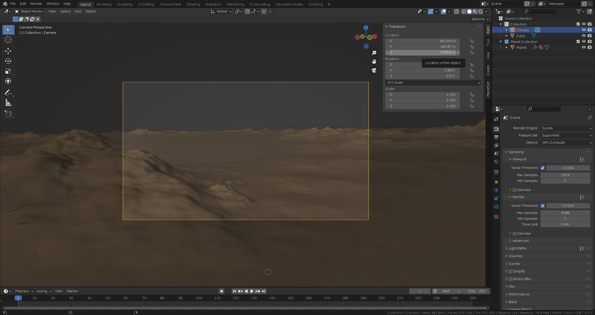

This tutorial will describe step-by-step how the render above was produced using PlanetSet.

Start a new Blend file. Make sure to keep the camera, but you can delete the default cube and lamp.

Create a planetary terrain by enabling planet in the PlanetSet toolbar.

Press the `Adjust Cycles Settings` button to switch over to Cycles for rendering.

To create a mountain landscape, add a Power Noise Terrain modifier from the `Add Terrain Modifier` menu.

You will now have a basic landscape to work with. You can use the flycam mode to navigate around the scene more easily by pressing ++shift+grave++.

When you have found an angle you are happy with, use the `Align Camera to View` operator, which you can find by pressing ++space++ to bring up the operator search menu.

This will reconstruct the terrain LOD relative to the view you chose:

Check the camera's height (z coordinate) by selecting it and viewing the Item panel. In this example, the camera height is approximately 80m, so the projection height is set to this value.

Now enable the atmosphere, by checking it in the PlanetSet panel and start the viewport renderer.

The day sky is very bright, so the film exposure will need turning down by selecting the camera and going to the camera data properties:

{: .zoom}

Turning down the exposure to 0.1:

{: .zoom}

{ .zoom}

Now adjust the sun elevation and angle in the world properties panel so that it is facing the camera.

You can also hide the floor grid and axes overlays in the viewport overlay options to declutter the viewport.

{: .zoom}

Now enable clouds and add a mist volume layer via the `Add Cloud Layer` menu.

Add a mist volume.

Add a generic clouds layer.

Translate the cloud layer in the xy plane by pressing ++g++ and then ++shift+z++. You must not translate clouds in the z axis or it will not curve with the planet surface correctly.

{: .zoom}

Adjust the cloud layer parameters to the ones in the screenshot which will produce small light cumulus clouds.

Also set the sun glow to 1 and make the atmosphere ceiling 3000m.

{: .zoom}

{: .zoom}

Set the base patch size to 1 to increase the terrain ridge details for the final render. It doesn't need to be much smaller as the terrain will be quite dark and details wont be visible.

{: .zoom}

You can also add more clouds in the distance to fill the sky more. The settings in the screenshot above produce large cumulus clouds over the horizon.

Don't forget, you can hide the cloud wireframes if they bother you by toggling the viewport overlays or you can change the viewport display to bounds.

Now everything is ready to render!