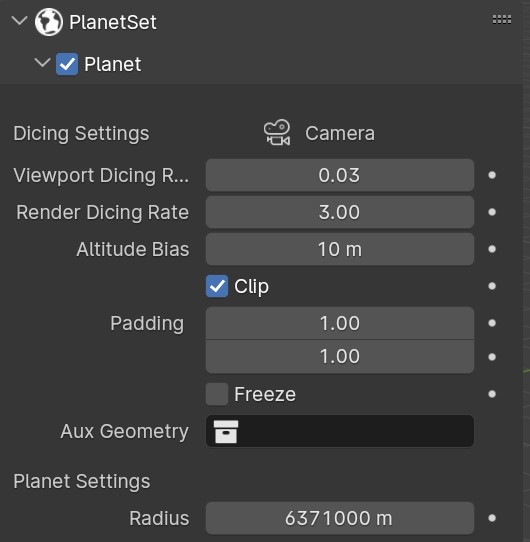
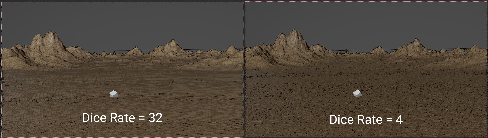
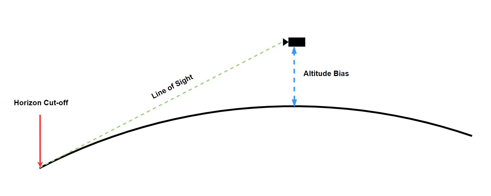
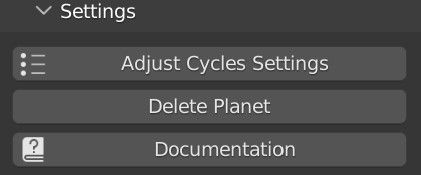

# Creating a Planet Terrain

{: width=50% }

To create a planet set, enable the checkbox in the Planet Panel header. A new collection called 'Planet Collection' will be added to the scene, which is where all the generated planet content is placed. In the collection, a section of spherical planet surface called 'Planet' will be generated relative to the scene's [active camera](https://docs.blender.org/manual/en/latest/editors/3dview/navigate/camera_view.html#setting-the-active-camera).

!!! Note

    Do not rename the collections generated by PlanetSet or move generated objects into different collections, as this will cause the references to those objects to be lost.

!!! Tip

    It is normally too slow to move the main camera around in realtime, you should move the viewport view instead and then use the [Align Camera To View](https://docs.blender.org/manual/en/2.79/editors/3dview/navigate/align.html#align-view-menu) operator to set the main camera view to the viewport view.

# Dice Settings

### Active Camera

The active camera name is displayed at the top of the dice settings.

You must have an [active camera](https://docs.blender.org/manual/en/latest/editors/3dview/navigate/camera_view.html#setting-the-active-camera) in the scene for PlanetSet to generate terrain relative to. The camera in the startup scene is active by default, so you can use this.

!!! Note

    The camera aspect ratio will only update when one of the planet properties are changed. You can also use the `Refresh` operator (available in the operator search menu) to force update everything.

### Dice Rate
The smallest size of a terrain facet in camera space. The smaller the value, the more detail the terrain will have at the expense of memory and processing time.

For final renders you should use dicing rates of 1 and below. Note if you see small gaps in the terrain, these will not be visible at lower dicing rates.

{: .zoom }

### Altitude Bias
At a view height of 2m , the distance to the horizon is about 5km. At 10m, the distance is about 11km. The altitude bias adds onto the altitude of the camera, which is important because often large terrain features (like a mountain) peek over the horizon and so extra geometry beyond the horizon is needed.

### Clip
If enabled, will discard planet geometry outside the camera frustum. This can save a lot of memory and terrain processing time. You can extend the limits of the camera frustum clipping by changing the padding settings.

### Padding
Specifies the horizontal and vertical padding for the camera frustum. Can be used to remove gaps near the view edges and to account for significant features near the frustum edges.

## Planet Settings

### Radius
This is the radius of the planet which alters the curvature of the surface. The default value is 6371,000m which is the radius of the Earth. Although the terrain may appear flat in the editor, it is actually patch of a large sphere which resultantly produces a horizon.

You don't really need to change this value unless you wish to mimick different planets.

---

# Settings

To access the planet settings, expand the Settings sub panel in the PlanetSet Panel.

{: style="width: 50%;"}

### Adjust Cycles Settings

Configures Cycles to the optimal rendering settings for PlanetSet scenes.

### Delete Planet

Deletes the entire planet collection and all objects inside.

Once the planet checkbox is enabled, disabling it will only hide the planet in the viewport so that it can conveniently be hidden when needed. To actually delete the planet collection, press the Delete Planet button.

### Documentation

Opens this documentation website in the browser.