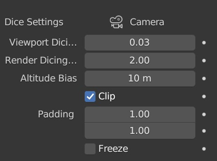
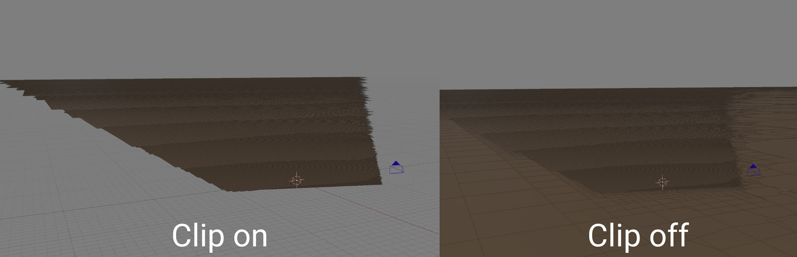

# Creating a Planet Terrain

{: width=50% }

To create a planet set, enable the checkbox in the Planet Panel header. A new collection called 'Planet Collection' will be added to the scene, which is where all the generated planet content is placed. In the collection, a section of spherical planet surface called 'Planet' will be generated relative to the scene's [active camera](https://docs.blender.org/manual/en/latest/editors/3dview/navigate/camera_view.html#setting-the-active-camera).

{: width=50% }

!!! Note

    Do not rename the collections generated by PlanetSet or move generated objects into different collections, as this will cause the references to those objects to be lost.

## Moving the Camera

It is normally too slow to move the main camera around in realtime with small dice rates. You can use the [freeze option](#freeze) to stop updating the planet terrain whilst finding new camera angles. Alternatively, you can use the [Align Camera To View](https://docs.blender.org/manual/en/2.79/editors/3dview/navigate/align.html#align-view-menu) operator to set the main camera view to the viewportview.

# Dice Settings

PlanetSet's terrain system works by adaptively 'dicing' (a.k.a subdividing or tessellating) the terrain relative to the camera. It works such that every facet of the terrain takes up the same amount of screen area, which is set by the [dicing rate](#dicing-rate). This way, it is possible to create very large and detailed terrains without using too much memory.

{: width=40% }

### Active Camera

The active camera name is displayed at the top of the dice settings.

You must have an [active camera](https://docs.blender.org/manual/en/latest/editors/3dview/navigate/camera_view.html#setting-the-active-camera) in the scene for PlanetSet to generate terrain relative to. The camera in the startup scene is active by default, so you can use this.

!!! Note

    The camera aspect ratio will only update when one of the planet properties are changed. You can also use the `Refresh` operator (available in the [operator search menu](https://docs.blender.org/manual/en/latest/interface/controls/templates/operator_search.html)) to force update everything.

### Dicing Rate
The dicing rate controls the number of tessellated facets per pixel in the camera space. It is therefore dependent on the render output resolution.

There are two dicing rate options available for the viewport and final render. For final quality renders, the dicing rate is typically greater than 1 (i.e. at least one face per pixel).

As an example, if the output resolution is 1920 x 1080 and the terrain is fully in view, there would be approximately 2 million faces (one per pixel) on the terrain mesh if the dicing rate was 1.

Note that if you see small gaps in the terrain, these will not be visible at lower dicing rates.

### Altitude Bias
At a view height of 2m , the distance to the horizon is about 5km. At 10m, the distance is about 11km. The altitude bias adds onto the altitude of the camera, which is important because often large terrain features (like a mountain) peek over the horizon and so extra geometry beyond the horizon is needed.

### Clip
If enabled, will discard planet geometry outside the camera frustum. This can save some memory and reduce terrain latency, but some shading effects may benefit on having geometry outside the camera frustum. You can additionally extend the limits of the camera frustum clipping by changing the padding settings.

### Padding
Specifies the horizontal and vertical padding for the camera frustum. Can be used to remove gaps near the view edges and to account for significant features near the frustum edges.

### Freeze
When enabled, the terrain will not update. This can be useful when moving the active camera or making changes without the latency of the planet geometry updates.

To keep the displacement node tree open when the terrain is frozen you must pin it in the node editor, otherwise it will disappear until the terrain is unfrozen.

{: width=50% }

### Aux Geometry (Advanced)
Another collection of base geometry can be used in addition to the planet surface, e.g. metablobs to create rock formations. All the geometry inside the aux collection will copied into the tessellated geometry then diced and displaced like the terrain. You should disable the collection's visibility in the outliner for both the viewport and render. Either geometry node IDs or named integer attributes can be used to distinguish geometry in the displacement nodes (the planet surface has ID = 0).

## Planet Settings

### Radius
This is the radius of the planet which alters the curvature of the surface. The default value is 6371,000m which is the radius of the Earth. Although the terrain may appear flat in the viewport, it is in fact a large patch of a sphere which resultantly produces a horizon.

---

# Settings

To access the planet settings, expand the Settings sub panel in the PlanetSet Panel.

{: style="width: 50%;"}

### Adjust Cycles Settings

Configures Cycles to the optimal rendering settings for PlanetSet scenes. It's reccommended to use this when you set up a new scene using PlanetSet.

### Delete Planet

Deletes the entire planet collection and all objects inside.

Once the planet checkbox is enabled, disabling it will only hide the planet in the viewport so that it can conveniently be hidden when needed. To actually delete the planet collection, press the Delete Planet button.

### Documentation

Opens this documentation website in the browser.