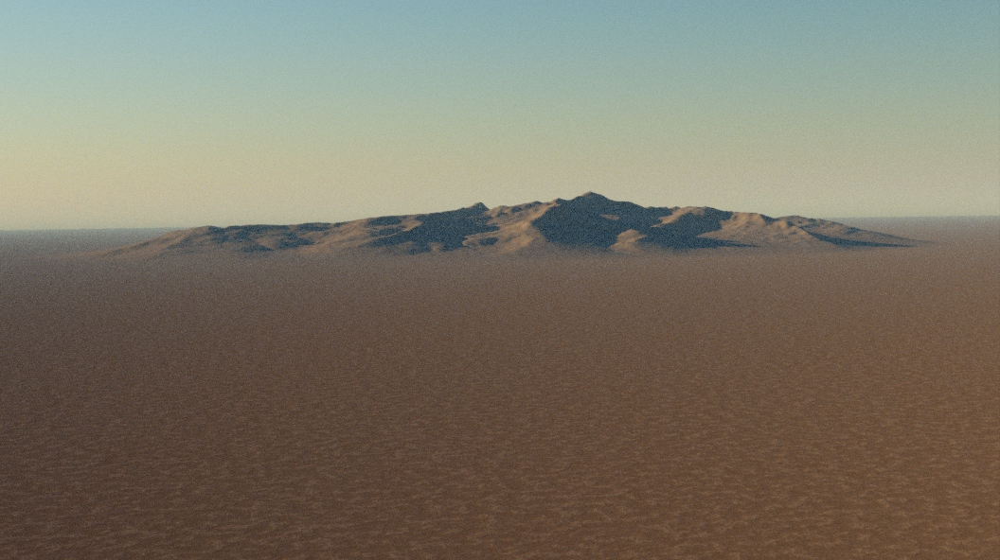

Once you have a flat planet surface, you can start creating terrain using geometry node modifiers. PlanetSet comes with some premade geometry node modifiers that can be combined to create various types of landscapes. When you have familiarised yourself with how they work, you can make your own terrain modifiers using the [User Displacement](#user-displacement) template or from scratch.

Premade modifiers can be added via the `Add Terrain Modifier` menu.

The terrain modifiers will appear in the [modifier properties]() panel proceeding the planet modifier.

---

# Generators

Generators are the starting point in terrain creation that create basic landscape features.

## Noise Terrain

This modifier creates low frequency hilly features which is useful as a starting point for forming a landscape. It's essentially just displacement using a standard noise node.

### Parameters

**Offset**  
Shifts the noise position along the xy plane and vertically in z (in meters).

**Scale**  
Scale of the noise in the world xy plane (does not affect height). Smaller values produce larger features.

**Amplitude**  
Maximum height of the noise (in meters). *Note* when using large amplitudes, you may wish to apply a negative z offset of half the amplitude value to bring the mid point down to sea level.

## Power Noise Terrain

This is a slightly more complicated modulated noise pattern that creates more believable terrain features such as moutains and valleys.

### Parameters

**Scale**  
The scale of the noise features in the xy coordinates (height not affected). Larger values produce smaller features.

**Distortion**  
Controls the strength of distortion in the noise which creates a warp effect.

**Exponent**  
This is the exponent part of the power noise. Increasing the value amplifies larger features relative to the smaller ones. However, it decreases the overall amplitude, so the amplitude will need increasing to compensate for this.

**Detail**  
The smallest level of detail in the noise pattern. 30 should be sufficient unless the noise is very large scale, whereby you may want to increase the value.

**Vector**  
The offset vector of the noise (in meters). Changes in the x and y will shift the noise features around along the planet surface. Changes in z will shift the entire terrain vertically.

!!! Tip
    Since Blender noise does not currently implement seeds, you can find new variations of noise by using large shifts in the x and y axes.

**Variance Scale**  
Variance modulates the contribution of detail over the terrain, creating a more natural looking surface. This controls the scale of the modulation. Larger values will create more variation over a smaller amount of space and vice versa for smaller values.

**Variance Exponent**  
Increasing this value makes the variance change more harshly.

## Radial Heightfield

If you wish to bring in satellite digital elevation maps or heightmaps from other terrain generation software, you can use this modifier. It radially masks the heightmap to blend it with the surrounding terrain.

### Parameters

**Position**  
Position of the center of the heightfield in the xy plane along the planet surface. The z component will change the overall elevation of the heightfield which can be used to align the heightmap's sealevel to the planet sealevel. Units are in meters.

**Radius**  
The radius of the heightfield circle (in meters).

**Falloff Radius**  
The radius, starting from the outside of the heightfield circle and going towards the center that is used for blending the terrain with surroundings. Larger values will create a longer transition. A zero value will eliminate the falloff effect and create a hard boundary.

**Amplitude**  
The maximum displacement height of the heightfield (in meters).

**Angle**  
Angle of rotation of the heightfield (through the z axis).

# Effects

Effects modify existing terrain features.

## Erosion Fractal

This adds a hydraulic erosion and deposition effect to the existing terrain. It works well over low frequency smooth terrain, but not on terrain with lots of details. The picture below is the Noise Generator example with the erosion fractal added.

#### Parameters

**Scale**  
Sets the base scale of the erosion features in the xy plane (does not affect erosion depth). If this value gets too low, it can yield unnatural looking results.

**Erosion Strength**  
Controls the amplitude of the erosion effect.

**Directionality**  
Controls how much the erosion pattern follows the slope of the terrain.

**Base Sediment Level**  
Value between 0,1 that defines the level of sediment deposition at the base height. A higher value will raise the level of deposition at the higher points of the terrain.

**Upper Sediment Level**  
Like upper sediment level, but for the base height. Usually making this value greater than the upper seiment level value will yield more nautral looking results (since sediment flows downwards).

**Base Sediment Height**  
The terrain height (in meters) in which the sediment level will be equal to the base sediment level.

**Upper Sediment Height**  
The terrain height (in meters) in which the sediment level will be equal to the upper sediment level.

## Terrace

This quantizes the terrain into different strata levels.

### Parameters

**Num Levels**  
The number of discrete altitude levels to divide the terrain into.

**Sharpness**  
Controls the harshness of the jumps between the terraces.

**Sub Terraces**  
The number of discrete levels in the sub-terraces, which modulate the regular terraces.

**Sub Terrace Sharpness**  
The steepness of the sub terraces.

**From Min**  
The lower height level of the terrain. The terrain will be terraced in region between the minimum and maximum heights. Therefore, you should ensure the min and max heights encapsulate all of your terrain.

**From Min**  
The upper height level of the terrain.

# Miscellaneous

## User Displacement

This is a geometry nodes template for creating your own displacements. The template works by taking the coordinate of the terrain vertices, and mapping them to a displacement value which should be between 0 and 1 so that amplitude represents the real size of the displacement in meters.

In general, you will get the most control with your own node setups - the presets exist mainly as a starting point.