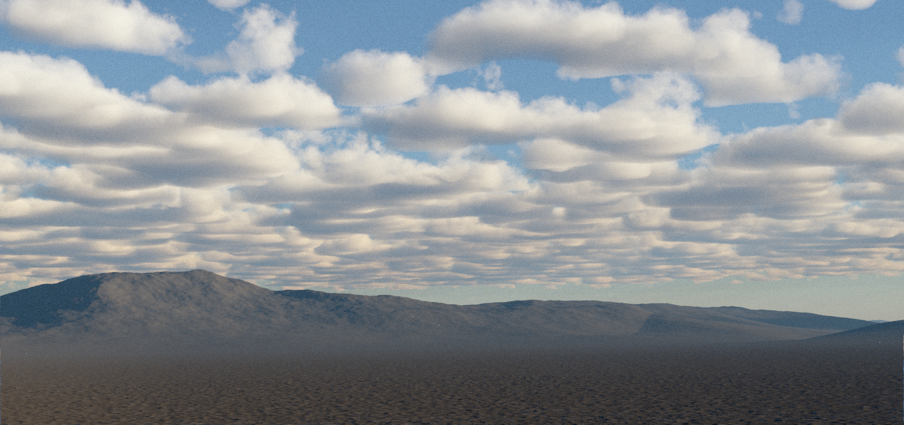

# Creating Terrains with Geometry Nodes

Once you have a flat planet surface, you can start creating terrain using geometry nodes. PlanetSet comes with some premade geometry node groups that can be combined to create various types of landscapes.

Preset nodes can be found in the default displacement group.

---

# Preset Terrain Geometry Nodes

## Power Noise Terrain

This is a slightly more complicated modulated noise pattern that creates more believable terrain features such as moutains and valleys. It is used in the default node network.

### Parameters

**Scale**  
The scale of the noise features in the xy coordinates (height not affected). Larger values produce smaller features.

**Distortion**  
Controls the strength of distortion in the noise which creates a warp effect.

**Exponent**  
This is the exponent part of the power noise. Increasing the value amplifies larger features relative to the smaller ones. However, it decreases the overall amplitude, so the amplitude will need increasing to compensate for this.

**Detail**  
The smallest level of detail in the noise pattern. 30 should be sufficient unless the noise is very large scale, whereby you may want to increase the value.

!!! Tip
    Since Blender noise does not currently implement seeds, you can find new variations of noise by using large shifts in the x and y axes.

**Variance Scale**  
Variance modulates the contribution of detail over the terrain, creating a more natural looking surface. This controls the scale of the modulation. Larger values will create more variation over a smaller amount of space and vice versa for smaller values.

**Variance Exponent**  
Increasing this value makes the variance change more harshly.

**Offset**  
The offset vector of the noise (in meters). Changes in the x and y will shift the noise features around along the planet surface.

## Radial Heightfield

If you wish to bring in satellite digital elevation maps or heightmaps from other terrain generation software, you can use this modifier. It radially masks the heightmap to blend it with the surrounding terrain.

### Parameters

**Image**  
The image to be used as a heightfield.

**Position**  
Position of the center of the heightfield in the xy plane along the planet surface. The z component will change the overall elevation of the heightfield which can be used to align the heightmap's sealevel to the planet sealevel. Units are in meters.

**Radius**  
The radius of the heightfield circle (in meters).

**Falloff Radius**  
The radius, starting from the outside of the heightfield circle and going towards the center that is used for blending the terrain with surroundings. Larger values will create a longer transition. A zero value will eliminate the falloff effect and create a hard boundary.

**Amplitude**  
The maximum displacement height of the heightfield (in meters).

**Angle**  
Angle of rotation of the heightfield (through the z axis).

## Ridged Mountains

A more natural looking mountain noise that features ridged mountains and valleys with resemblance of drainage basins.

### Parameters

**Scale**  
The scale of the noise features in the xy coordinates (height not affected). Larger values produce smaller features.

**Amplitude**  
The height multiplier (in meters). Larger values produce taller features.

**Offset**  
The offset vetor that can be used to translate the noise in the xy plane. The z offset varies the noise look.

## Stones

Creates a procedural pebble pattern that can be used to create small displacements that resemble stones in the ground.

### Parameters

**Scale**  
The xy scale of the stone center points (higher value increases stone frequency).

**Mask**  
Value from 0 to 1 that can be used to hide the stones procedurally. i.e. with a noise texture.

**Variation**  
Value between 0 and 1 that increases the variation in stone size.

**Stone Size**  
The baseline radius of the stones (does not affect height).

**Stone Height**  
The vertical height scaling of the stones (in meters).

## Ocean Texture

Texture that mimicks ocean waves. Can be used on the ocean displacement node group to create 3D displacement on water bodies.

### Parameters

**Scale**  
The xy scale of the stone center points (higher value increases stone frequency).

# Effects

## Normal Displacement

{: width=20% }

Displaces the terrain geometry in the direction of the surface normal by the height input value which can be strengthened with the strength parameter. You would typically use a procedural pattern like noise to create endless displacement effects.

The default displacement nodes consist of two normal displacement passes: one for the main large terrain features, and another for the ground details. You can use many displacement passes in series to create interesting effects.

## Vector Displacement

{: width=20% }

Displaces the terrain geometry along a custom vector direction by the height input value.

## Erosion Fractal

This adds a hydraulic erosion and deposition effect to the existing terrain. It works well over low frequency smooth terrain, but not on terrain that already has lots of details.

### Parameters

**Scale**  
Sets the base scale of the erosion features in the xy plane (does not affect erosion depth). If this value gets too low, it can yield unnatural looking results.

**Erosion Strength**  
Controls the amplitude of the erosion effect.

**Directionality**  
Controls how much the erosion pattern follows the slope of the terrain.

**Base Sediment Level**  
Value between 0,1 that defines the level of sediment deposition at the base height. A higher value will raise the level of deposition at the higher points of the terrain.

**Upper Sediment Level**  
Like upper sediment level, but for the base height. Usually making this value greater than the upper seiment level value will yield more nautral looking results (since sediment flows downwards).

**Base Sediment Height**  
The terrain height (in meters) in which the sediment level will be equal to the base sediment level.

**Upper Sediment Height**  
The terrain height (in meters) in which the sediment level will be equal to the upper sediment level.

## Terrace

This quantizes the terrain height into different random strata levels.

### Parameters

**Num Levels**  
The number of discrete altitude levels to divide the terrain into.

**Sharpness**  
Controls the harshness of the jumps between the terraces.

**Sub Terraces**  
The number of discrete levels in the sub-terraces, which modulate the regular terraces.

**Sub Terrace Sharpness**  
The steepness of the sub terraces.

**From Min**  
The lower height level of the terrain. The terrain will be terraced in region between the minimum and maximum heights. Therefore, you should ensure the min and max heights encapsulate all of your terrain.

**From Min**  
The upper height level of the terrain.

## Proximity Leveller

Levels the terrain (in z axis) towards a target object, relative to the distance to the target object (e.g. a curve). Useful for creating specific areas of flat land for buildings or roads.

{: width=60% }
{: width=60% }

### Parameters

**Object**  
The target object (works with curves too).

**Min Distance**  
The mimimum distance cut-off (in metres) to the target object for the level effect.

**Max Distance**  
The maximum distance (in metres) to the target object for the level effect. The terrain will be unaffected beyond this distance from the target object.

## Strata

This is similar to the terrace node, in that it rounds the existing terrain level. You can set the angles of the plateau and cliff sections,which allows for more specific control.

{: width=80% }

### Parameters

**Strata Size**  
The vertical height in meters of each strata level. You can parameterise this with noise to add some variation.

**Primary Angle**  
The angle of the cliff sections of the strata (in degrees). Zero will result in vertical cliffs and anything over zero will create more of a slope.

**Plateau Angle**  
The angle of the flatter sections of the strata (in degrees). Zero will result in horizontal plateaus and anything over zero will create sloped plateaus.

**Mask**  
Value bewteen 0 and 1 that interpolates between the strata effect and the base terrain (1 is full strata effect).

## Cliff Rocks

Creates the effect of rock seams on near vertical slopes of the existing terrain. Work well in combination with noise to distort the cliff faces before.

{: width=70% }
{: width=70% }

### Parameters

**Scale**  
Scale factor of the rock texture.

**Amplitude**  
The displacement amplitude in meters.

---

# Mask Nodes

Mask nodes output a value between 0 and 1 in basic shapes that can be used to manipulate terrain features. The inverse outputs the opposite value.

## Circle Mask

{: width=20% }

### Parameters

**Center**  
The center point of the circle.

**Radius**  
The radius of the circle.

**Falloff Radius**  
The radius of the smooth transition on the outside of the circle.

## Rectangular Mask

{: width=20% }

### Parameters

**Center**  
The center point of the circle.

**Size X**  
The length of one of the rectangle sides.

**Size Y**  
The length of the other rectangle side.

**Angle**  
Specifies the rotation of the rectangle in degrees.

**Falloff Radius**  
The distance for the smooth transition on the outside of the rectangle.