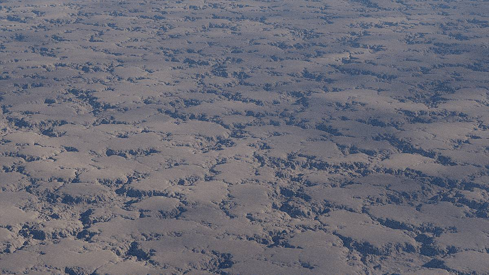

Blender only offers a few different noise nodes, but by combining them it is possible create a wide range of textures and patterns.

## Domain Distortion

Domain distortion is a technique used to create interesting and unique noise patterns by modifying the way that procedural noise is generated. Essentially, domain distortion involves warping the input space of a noise function in a non-uniform way, creating a distorted version of the original noise pattern.

For example, take this Voronoi noise used to displace the terrain surface:

{: .center width=50%}
{: .center width=70%}

- Now take the RGB color output of a regular noise node and subtract (0.5, 0.5, 0.5) from it using a `Vector Math` node to center it around zero.
- Scale the noise vector using a `Vector Math` node to control the distortion strength.
- Add the noise vector to the position vector using a `Vector Math` node and a `Position` input node.
- Input the new vector to the Voronoi noise node.

{: .center width=100%}
{: .center width=70%}

## Curve Remapping

The `Float Curve` node is a great way to reshape the noise into anything we want.

For example reshaping the Voronoi noise output:

{: .center width=80% }
{: .center width=80% }

Now adding domain distortion like mentioned above:

{: .center width=100% }
{: .center width=80% }

This could be cracks in the ground if it were small, or we could scale it up and make it into something resembling canyons:

{: .center width=80% }