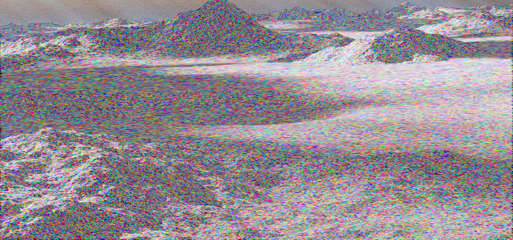
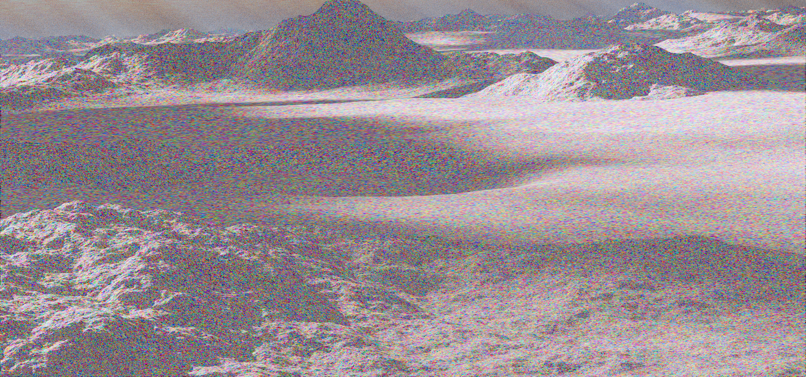
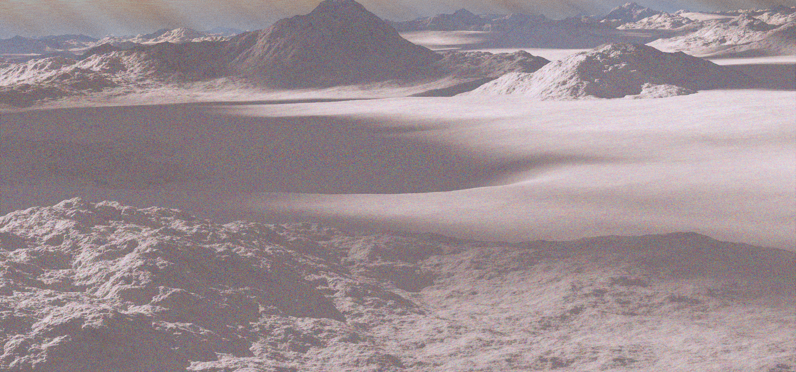
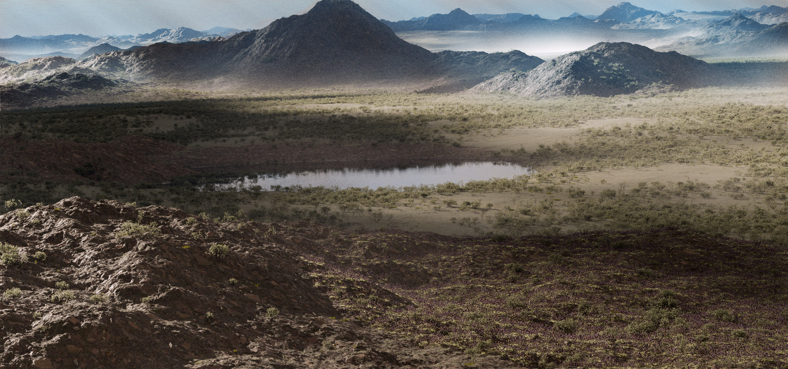

PlanetSet's core feature is the ability to render large terrains with high levels of detail at all distances. The terrain dicing system ensures that the terrain mesh always occupies a specific density of quads per pixel in screen space. Understanding this feature is essential for using the terrain workflow.

**Outline of dicing process:**  
&nbsp;&nbsp; 1. Start off with a large, coarse spherical planet surface mesh  
&nbsp;&nbsp; 2. Remove bits of the surface that aren't visible (over the horizon)  
&nbsp;&nbsp; 3. Repeat the following until the dicing loop count reaches maximum:  
&nbsp;&nbsp;&nbsp;&nbsp;&nbsp;&nbsp;&nbsp;&nbsp;- Apply the user's displacement nodes to the surface  
&nbsp;&nbsp;&nbsp;&nbsp;&nbsp;&nbsp;&nbsp;&nbsp;- Subdivide each quad that doesn't satisfy the projected area in screen space (dicing rate)  
&nbsp;&nbsp;&nbsp;&nbsp;&nbsp;&nbsp;&nbsp;&nbsp;- Start over again with the newly subdivided surface  

Higher dicing rates take more time and memory. Making changes to the displacement nodes in realtime can be slow, which is why the dicing rate in the viewport is very low.

## Visualisation of Dicing Rates

Each quad in the terrain has been randomly coloured for visualisation purposes.  

**0.05 Facets Per Pixel:**  

**0.25 Facets Per Pixel:**  

**0.5 Facets Per Pixel:**  

**1 Facet Per Pixel:**  

**4 Facets Per Pixel (recommended for final renders)**  

**The Final Render (4 fpp)**  
