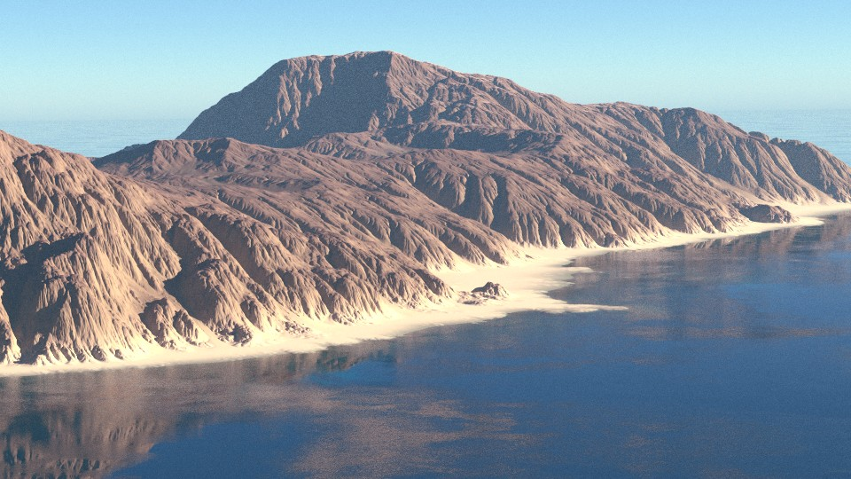
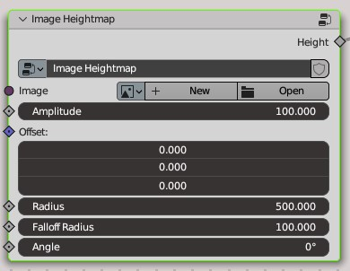
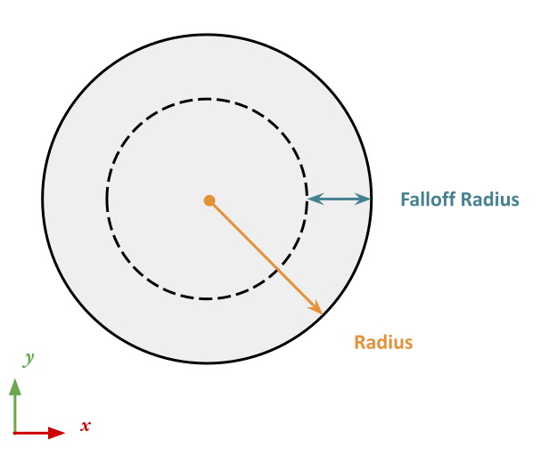
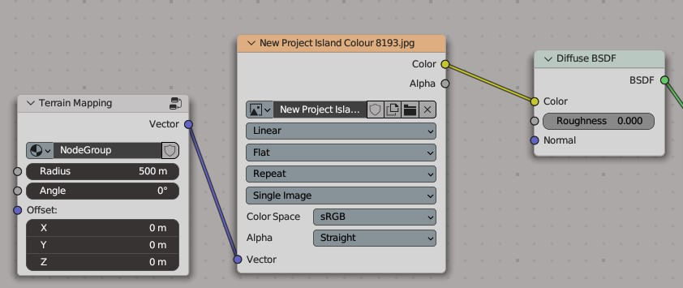

PlanetSet comes with some utilities for importing height maps and other terrain textures from external software such as Gaea, World Machine and World Creator.

{: .center width=70% }

## The Image Heightmap Node

If you have some experience with Geometry Nodes, displacing the terrain surface by an image should be trivial to setup manually, however PlanetSet comes with some preset nodes for convenience.

The `Image Heightmap` node group is available in the preset nodes that are imported when you enable PlanetSet. It has controls for positioning your heightmap texture in world space, controlling the size and also a falloff for blending the heightmap with the surrounding terrain.

Import your heightmap by opening an image. Recommended formats are 16-bit or 32-bit float images (e.g. `.exr`, `.tiff`, `.png`) to avoid precision artifacts.

The **amplitude** parameter simply scales the output of the image. If your image is already in the correct units (not normalized) then you will want to set this value to 1.0.

The **offset** parameter determines where the centre of the heightmap will be in world space. Note that if the texture is set t repeating, you will see many copies of it over the planet surface which can make it hard to see where the centre actually is.

The **radius** parameter controls the scale of the texture; it is the distance from the centre point of the heightmap to the edge. It is referred to as 'radius' because the falloff setting works radially.

The **falloff radius** controls the distance in which the heightmap is tapered off from the radius inwards:

{: .center width=60% }

The **angle** parameter controls the direction of the heightmap with respect to the up z axis. It is in units of degrees. At zero degrees, the positive y axis of the image aligns with the negative axis of the y-axis in world space.

## Material Textures

To match the mapping of the displacement heightmap with an image in your terrain material, you can use the `Terrain Mapping` node in the shader editor. This node group is imported into your scene when PlanetSet is enabled. It uses the same parameters as the `Image Heightmap` node so you can match the results.

