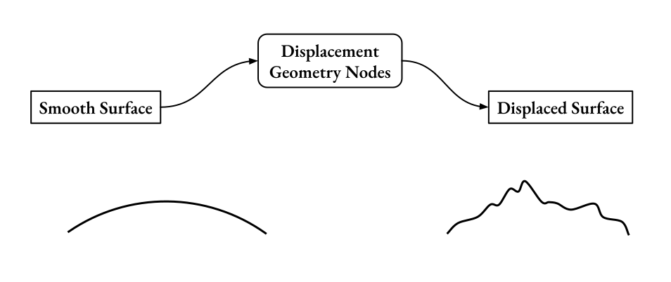

Terrain in PlanetSet is created using Geometry Nodes, since this system provides the most flexibility. Specifically, all modifications made to the terrain are done inside the in the `Displacement` node group, which is part of the `Planet` object.

Inside the displacement group node, there is a geometry input and a geometry output. The input geometry is simply a smooth spherical planet surface (which appears flat when you are close to the surface). By modifying this base shape using geometry nodes, we can make it into a terrain geometry and feed it to the output of the `Displacement` node group.

{: .center width=80% }

To show the smooth planet surface, open the `Displacement` geometry nodes group and connect the geometry input to the geometry output:

{: .center width=50% }

Which will produce a flat surface like this:

{: .center width=60% }

You can see it goes all the way to the horizon by changing the camera view:

{: .center width=80% }

Let's create a really simple terrain with noise by using the following setup:

{: .center width=80% }

- The `Power` node adds 'contrast' to the noise texture, making the hills more pointy.
- The `Multiply` node is necessary to make the mountains tall. The noise node outputs values in the range [0, 1], which corresponds to the displacement distance, so we need to multiply it to make it larger.
- The `Normal Displacement` node is a preset node group available in the `Add->Group` menu. It takes the current geometry and applies the height displacement along the surface normal.

This is the result:

{: .center width=80% }

Noise is procedural, so this works all the way to the horizon!

Let's preview this in Cycles. It's reccommended to use the `Auto Adjust Cycles Settings` operator for rendering PlanetSet scenes.

{: .center width=80% }

Also enable the atmosphere for lighting!

{: .center width=80% }

By turning up the power to 6 and the multipler value to 400, we get larger valleys between the mountains:

{: .center width=80% }
{: .center width=80% }

And hitting render with a 4 facets per pixel dicing rate...

{: .center width=100% }

This is a simple example, but many different landscapes can be made using noises alone. Next, we will look at using more complex noises to make terrain.