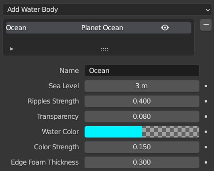
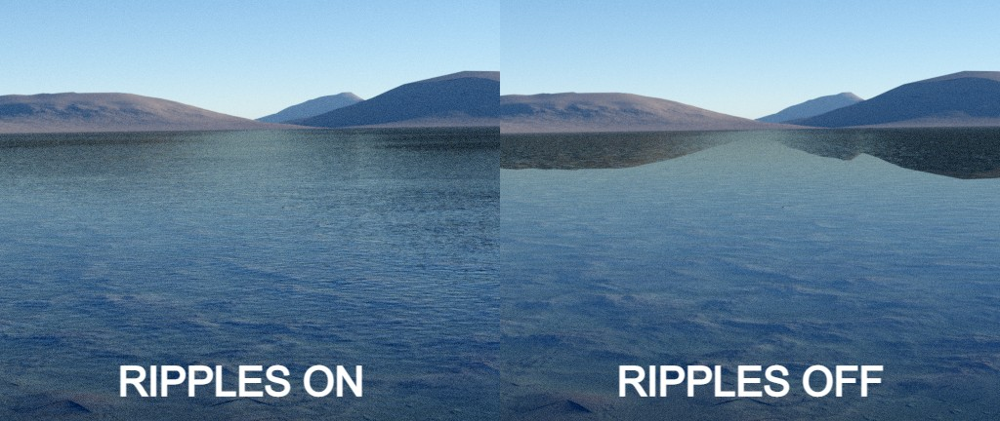

# Water Bodies

---

## Oceans

Oceans are water bodies that span the entire planet. They work like the terrain surface in that they are tessellated to the dicing rate.

The ocean surface has its own separate displacement group like the planet terrain that can be found inside the Planet Ocean geometry nodes modifier. By default, there is a small noise displacement applied to mimick small waves.

### Parameters

**Sea Level:** The height of the ocean surface above zero in the z axis.

---

## User Water Bodies

You can convert the selected mesh to a water body by choosing `Make Selection Water Body` in the `Add Water Body` menu. This will assign the PlanetSet water shader to the mesh link it to the water bodies panel.

This can be used to make smaller water bodies such as lakes or ponds.

---

## Water Shader Settings

**Ripples Strength:** Controls the ripple intensity.

Shader ripples become slightly 'blurred' in the distance, which is an effect 3D displaced ripples don't account for. Therefore it is reccommended to keep the ripple strength above zero for more realstic results, even if you are using displacement ripples.

**Transparency:** Higher values make the water surface appear more see-through by artificially increasing the transparency.

**Water Color:** The color of the water medium.

**Color Strength:** The intensity of the water color.

**Edge Foam Thickness:** The thickness of the foam effect around edges intersecting the water.