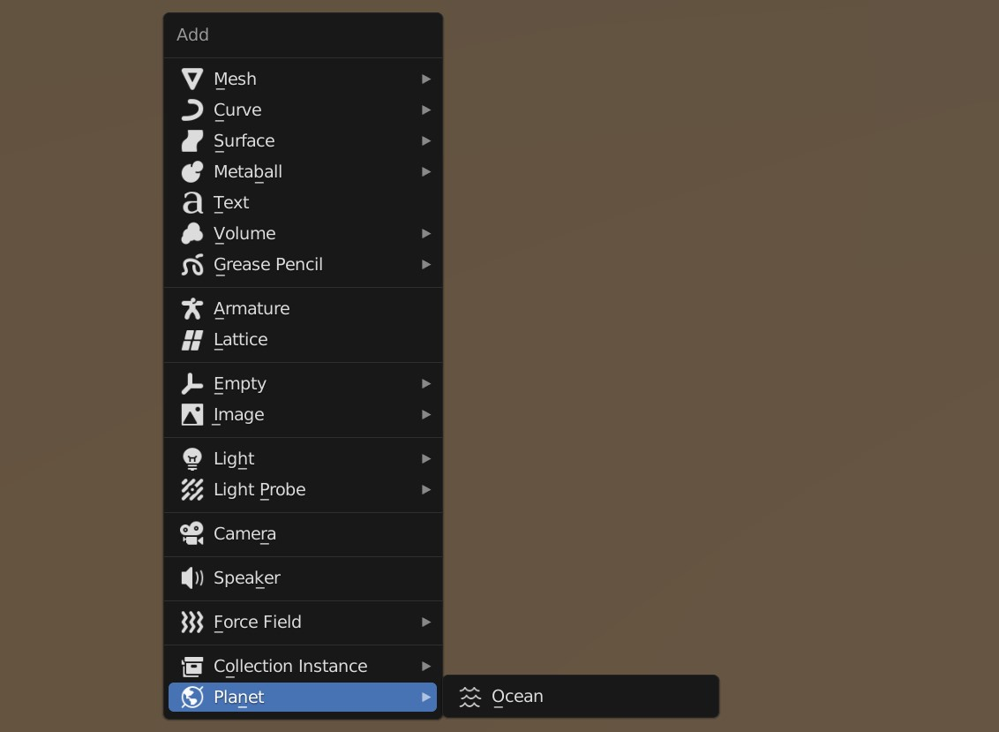

## Oceans

!!! Warning

    **Work In Progress** You can find the ocean material settings in the ocean object's custom properties.

Creating an ocean is like creating another planetary surface that extends over the horizon.

The add ocean option is inside the object add menu under the planet category:

{: width=50% }

You can translate the ocean plane in the z axis to adjust the sealevel. The ocean surface will use the same dice settings as the terrain.

The ocean surface has its own separate displacement group like the planet terrain that can be found inside the Planet Ocean geometry nodes modifier.